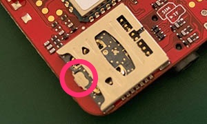
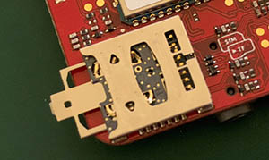
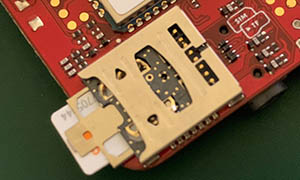
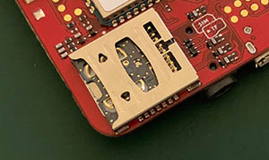
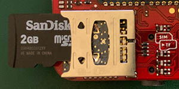
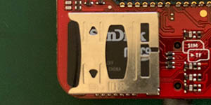
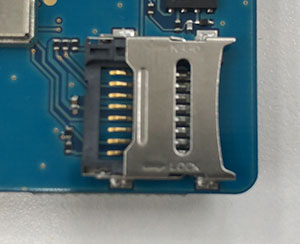
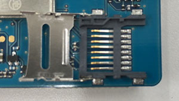
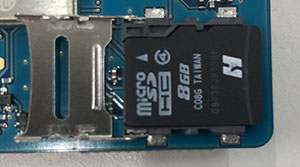
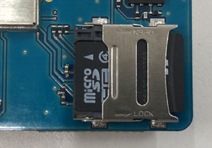

# How to install / remove cards

## SIM and TF card 2-in-1 slot
### SIM card
1. Pull the tray gently by using the thumb index.  
  
**Please do NOT pull the tray hardly more then the picture below.** It can be broken.  

1. Insert a nano SIM card under the tray as the shown direction below.  
  
1. And then, push the card in gently.  

To remove the card, please pull the tray out like step 1.

### TF card
1. Insert the TF card to the upper side of the slot along to the wall of the slot like the picture.   

1. And then, push the card in gently.  

To remove the card, please use  the thumb index of the TF card.

## Solo TF card slot
### TF card
1. As on the sign on the metal lid, slide the lid to "OPEN" direction. ( On this picture, left side. )

1. Got unlocked. Please lift the lid.  

1. Put the TF card onto the tray.  

1. Close the lid and press lightly and hold and slide to "LOCK" direction. ( On this picture, right side. )  
  
To remove the cards, please do same. 