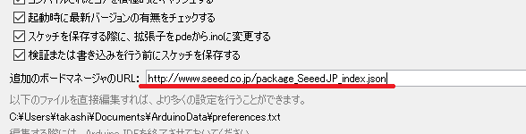
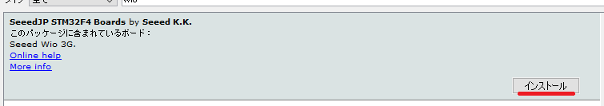

# Wio 3Gボードの追加

1. Arduino IDEを起動してください。
1. ファイル > 環境設定 （Macでは、Arduino > Preferences...）の 設定タブ にある"追加のボードマネージャのURL:"に、**http://www.seeed.co.jp/package_SeeedJP_index.json** を入力してください。  

1. ツール > ボード > ボードマネージャ で、SeeedJP STM32F4 Boards by Seeed K.K. を選択し、インストールをクリックしてください。  

