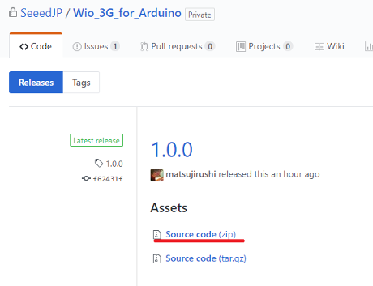
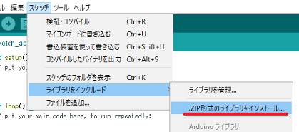

# Wio 3Gライブラリの追加

1. [Wio 3Gライブラリのgithubサイト](https://github.com/SeeedJP/Wio_3G_for_Arduino/releases)から、最新のSource codeをダウンロードしてください。  
(ダウンロードしたZIPファイルを解凍する必要はありません。)  

1. Arduino IDEを起動してください。
1. スケッチ > ライブラリをインクルード > .ZIP形式のライブラリをインストール を選択して、ダウンロードしたZIPファイルを指定してください。  

