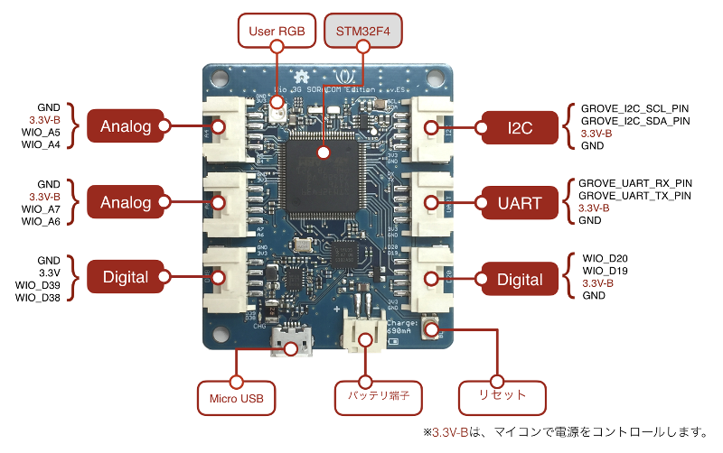

# ハードウェア

## 外観

## 仕様

|部品|機能|値|
|:--|:--|:--|
|STM32F4マイコン|プロセッサー|STM32F439VI, ARM Cortex-M4 with FPU, 180MHz|
||フラッシュメモリ|2Mバイト|
||内蔵SRAM|256Kバイト|
|3G|UMTS|800/850/900/1900/2100MHz|
||GSM/EDGE|850/900/1800/1900MHz|

## 回路図

* [Wio 3G SORACOM Edition v.ES(PDF)](files/Wio_3G_vES.pdf)
