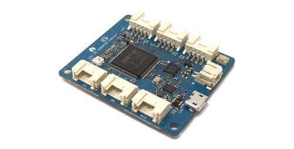

# Wio 3G for Arduino

Wio 3GのArduino IDE用ライブラリです。

## Wio 3G

Wio 3Gは、Seeedが開発しているマイコンモジュールです。  
GroveコネクターとSTM32F4マイコン、3Gモジュールが載っており、Arduino IDEで素早くプロトタイピングすることができます。

## 開発環境のセットアップ

開発環境のセットアップは[こちら](setup-ja.md)。

## ハードウェア

ハードウェアの情報は[こちら](hardware-ja.md)。

## リファレンスマニュアル

リファレンスマニュアルは[こちら](reference-ja.md)。

## サンプルプログラム

|スケッチ例|内容|必要なもの|接続コネクター|
|:--|:--|:--|:--|
|basic/LedSetRGB|LEDをレインボー表示します。|||
|basic/GetRSSI|受信信号強度をシリアルモニタに表示します。|||
|basic/GetTime|ネットワークと日時同期して、日時をシリアルモニタに表示します。|||
|grove/grove-button|Grove - ボタンのON/OFFをシリアルモニタに表示します。|[Grove - ボタン](https://www.seeedstudio.com/Grove-Button-p-766.html)|D38|
|grove/grove-buzzer|Grove - ブザーを鳴らします。|[Grove - ブザー](https://www.seeedstudio.com/Grove-Buzzer-p-768.html)|D38|
|grove/grove-magnetic-switch|Grove - 磁石スイッチのON/OFFをシリアルモニタに表示します。|[Grove - 磁石スイッチ](https://www.seeedstudio.com/Grove-Magnetic-Switch-p-744.html)|D38|
|grove/grove-rotary-angle-sensor|Grove - 可変抵抗の回転量をシリアルモニタに表示します。|[Grove - 可変抵抗](https://www.seeedstudio.com/Grove-Rotary-Angle-Sensor-p-770.html)|A4|
|grove/grove-temperature-and-humidity-sensor|Grove - 温湿度センサーの温度、湿度をシリアルモニタに表示します。|[Grove - 温湿度センサー](https://www.seeedstudio.com/Grove-Temperature-%26-Humidity-Sensor-p-745.html)|D38|
|grove/grove-ultrasonic-ranger|Grove - 超音波距離センサーの距離をシリアルモニタに表示します。|[Grove - 超音波距離センサー](https://www.seeedstudio.com/Grove-Ultrasonic-Ranger-p-960.html)|D38|
|grove/grove-gps|Grove - GPSの位置情報をシリアルモニタに表示します。|[Grove - GPS](https://www.seeedstudio.com/Grove-GPS-p-959.html)|UART|
|grove/grove-accelerometer|Grove - 加速度センサーの値をシリアルモニタに表示します。|[Grove - 3軸デジタル加速度センサー(±16g)](https://www.seeedstudio.com/Grove-3-Axis-Digital-Accelerometer%28%C2%B116g%29-p-1156.html)|I2C|
|soracom/soracom-funnel|Wio 3Gの稼働時間をSORACOM Funnelへ送信します。|[SORACOM Funnel](https://soracom.jp/services/funnel/)||
|soracom/soracom-harvest|Wio 3Gの稼働時間をSORACOM Harvestへ送信します。|[SORACOM Harvest](https://soracom.jp/services/harvest/)||
|soracom/soracom-ussd-test|"123"をUSSDを使ってSORACOM Beamへ送信します。|[SORACOM Beam](https://soracom.jp/services/beam/)||
|http/ifttt-webhook|Wio 3Gの稼働時間をIFTTTのWebhookへ送信します。|[IFTTT Webhook](https://ifttt.com/maker_webhooks)||
|mqtt/mqtt-client|Wio 3Gの稼働時間をMQTTブローカーへ送信します。|MQTT Broker||
