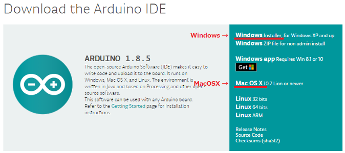
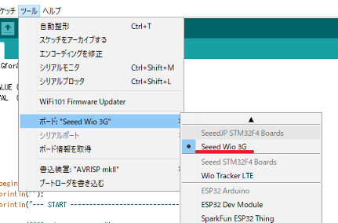
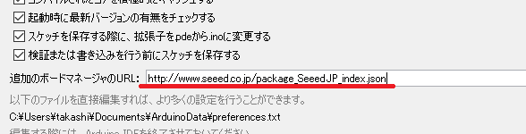
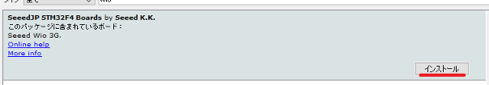
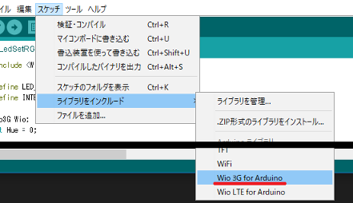
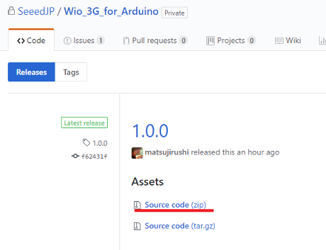
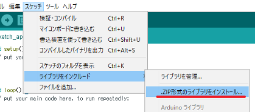
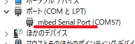
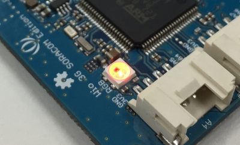

# 開発環境のセットアップ

## Arduino IDEのインストール

パソコンにArduino IDEがインストールされていない場合は、[ArduinoのSoftwareサイト](https://www.arduino.cc/en/Main/Software)のDownload the Arduino IDEにあるARDUINO x.x.xをダウンロード、インストールしてください。  
Wio 3GはAruino IDEのLinux版、Arduino Web Editorに対応していませんのでご注意ください。

**■Arduino IDEのダウンロード**  

## ボードの追加

Arduino IDEを起動して、"ツール > ボード"に`Seeed Wio 3G`が表示されているか確認してください。  
**■ボードの確認（ツール > ボード > Seeed Wio 3G）**  

見つからない場合は、次の手順を実施して、Wio 3Gボードの追加をしてください。
1. Arduino IDEを起動してください。
1. ファイル > 環境設定 （Macでは、Arduino > Preferences...）の 設定タブ にある"追加のボードマネージャのURL:"に、`http://www.seeed.co.jp/package_SeeedJP_index.json`を入力してください。  

1. ツール > ボード > ボードマネージャ で、`SeeedJP STM32F4 Boards by Seeed K.K.`を選択し、インストールをクリックしてください。  

## ライブラリの追加

Arduino IDEの、"スケッチ > ライブラリをインクルード"に`Wio 3G for Arduino`が表示されているか確認してください。
**■ライブラリの確認（スケッチ > ライブラリをインクルード > Wio 3G for Arduino）**  

見つからない場合は、次の手順を実施して、Wio 3Gライブラリの追加をしてください。
1. [Wio 3Gライブラリのgithubサイト](https://github.com/SeeedJP/Wio_3G_for_Arduino/releases)から、最新のSource codeをダウンロードしてください。  
(ダウンロードしたZIPファイルを解凍する必要はありません。)  

1. Arduino IDEを起動してください。
1. スケッチ > ライブラリをインクルード > .ZIP形式のライブラリをインストール を選択して、ダウンロードしたZIPファイルを指定してください。  

## シリアルポートドライバのインストール

Windows 10もしくはMac OS Xは、シリアルポートドライバのインストールは不要です。  
Windows 7, Windows 8.1の場合は、[Windows serial driverサイト](https://os.mbed.com/docs/latest/tutorials/windows-serial-driver.html)にあるArm Mbed Windows serial port driverをインストールしてください。

**■シリアルポートドライバの確認（Wio 3GをUSB接続し、デバイスマネージャーで確認）**  

# 開発環境の動作確認

## プログラムの書き込み

Wio 3GをパソコンにUSB接続しておき、ファイル > スケッチ例 > Wio 3G for Arduino にある`basic/LedSetRGB`を選択して、開いたスケッチを書き込みます。  
書き込んだ後にリセットして、Wio 3G上のLEDがカラフルに点灯すれば正常です。

1. Wio 3GをパソコンにUSB接続してください。（DAPLINKというドライブがパソコンに認識されます。）
1. Arduino IDEを起動してください。
1. Arduino IDEのボード選択を`Seeed Wio 3G`に変更してください。（ツール > ボード > Seeed Wio 3G）
1. スケッチ例の`basic/LedSetRGB`を開いてください。（ファイル > スケッチ例 > Wio 3G for Arduino > basic > LedSetRGB）
1. スケッチをWio 3Gに書き込んでください。（スケッチ > マイコンボードに書き込む）
1. ボードへの書き込みが完了するまで待ってください。（完了すると、DAPLINKドライブが自動的に外れ、再度、認識されます。書き込んだファイルはマイコンに転送され自動的に消えます。）
1. Wio 3G上のリセット（BLと書かれたボタン）を押してください。

**■LED点灯の様子**  

### おまけ
毎回リセットボタンを押すのが面倒な方へ
#### Break信号でリセット
お手持ちのシリアルターミナルで、Break信号を送ると、リセットできます。Tera Termの場合`Alt-B`、CoolTermの場合`Command-B`でBreak信号を送れます。（Arduino IDEのシリアルモニタでは、Break信号は送れません。）
#### 自動リセットをするようにする
DAPLINKドライブに、`auto_rst.cfg`という空のファイルをコピーすると、以降、マイコンに転送したあとに自動的にリセットがかかるようになります。