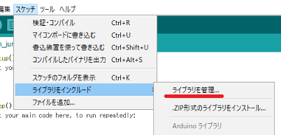
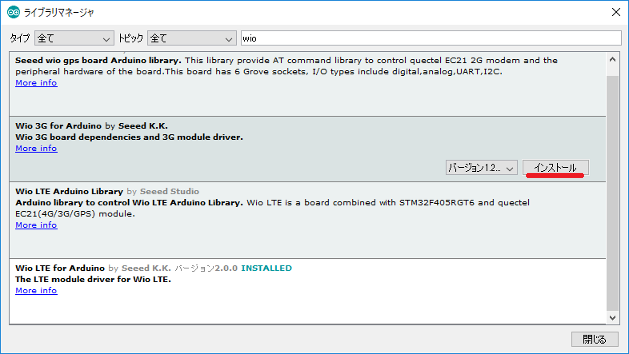

# 開発環境のセットアップ

## Arduino IDEのインストール

パソコンにArduino IDEがインストールされていない場合は、[ArduinoのSoftwareサイト](https://www.arduino.cc/en/Main/Software)のDownload the Arduino IDEにあるARDUINO x.x.xをダウンロード、インストールしてください。  
Wio 3Gは**Aruino IDEのLinux版、Arduino Web Editorに対応していません**のでご注意ください。

**■Arduino IDEのダウンロード**  

## ボードの追加

Arduino IDEを起動して、"ツール > ボード"に`Seeed Wio 3G`が表示されているか確認してください。  
**■ボードの確認（ツール > ボード > Seeed Wio 3G）**  

見つからない場合は、次の手順を実施して、Wio 3Gボードの追加をしてください。
1. Arduino IDEを起動してください。
1. ファイル > 環境設定 （Macでは、Arduino > Preferences...）の 設定タブ にある"追加のボードマネージャのURL:"に、`http://www.seeed.co.jp/package_SeeedJP_index.json`を入力してください。  

1. ツール > ボード > ボードマネージャ で、`SeeedJP STM32F4 Boards by Seeed K.K.`を選択し、インストールをクリックしてください。  

## ライブラリの追加

Arduino IDEの、"スケッチ > ライブラリをインクルード"に`Wio 3G for Arduino`が表示されているか確認してください。  
**■ライブラリの確認（スケッチ > ライブラリをインクルード > Wio 3G for Arduino）**  

1. Arduino IDEを起動してください。
1. スケッチ > ライブラリをインクルード > ライブラリを管理 を選択してください。  

1. Wio 3G for Arduino by Seeed K.K. を選択して、インストールしてください。  
上部に wio と入力すると、一覧表示が少なくなって探しやすいです。  

## シリアルポートドライバのインストール

Windows 10もしくはMac OS Xは、シリアルポートドライバのインストールは不要です。  
Windows 7, Windows 8.1の場合は、[Windows serial driverサイト](https://os.mbed.com/docs/latest/tutorials/windows-serial-driver.html)にあるArm Mbed Windows serial port driverをインストールしてください。

**■シリアルポートドライバの確認（Wio 3GをUSB接続し、デバイスマネージャーで確認）**  

# 開発環境の動作確認

## プログラムの書き込み

Wio 3GをパソコンにUSB接続しておき、ファイル > スケッチ例 > Wio 3G for Arduino にある`basic/LedSetRGB`を選択して、開いたスケッチを書き込みます。  
書き込んだ後にリセットして、Wio 3G上のLEDがカラフルに点灯すれば正常です。

1. Wio 3GをパソコンにUSB接続してください。（DAPLINKというドライブがパソコンに認識されます。）
1. Arduino IDEを起動してください。
1. Arduino IDEのボード選択を`Seeed Wio 3G`に変更してください。（ツール > ボード > Seeed Wio 3G）
1. Arduino IDEのマイコンボードに書き込む手段を`OpenOCD`に変更してください。（ツール > マイコンボードに書き込む > OpenOCD）
1. スケッチ例の`basic/LedSetRGB`を開いてください。（ファイル > スケッチ例 > Wio 3G for Arduino > basic > LedSetRGB）
1. スケッチをWio 3Gに書き込んでください。（スケッチ > マイコンボードに書き込む）
1. ボードへの書き込みが完了するまで待ってください。（完了すると、DAPLINKドライブが自動的に外れ、再度、認識されます。書き込んだファイルはマイコンに転送され自動的に消えます。）
1. Wio 3G上のリセット（BLと書かれたボタン）を押してください。

**■LED点灯の様子**  

