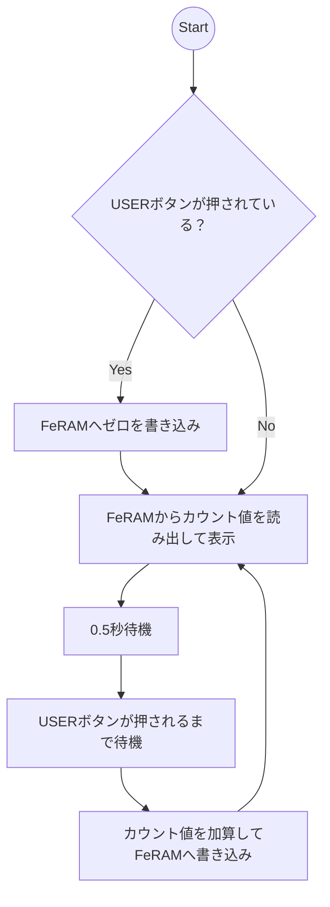

# Wio BG770A サンプルプログラム

|スケッチ|内容|依存ライブラリ|必要なもの|Groveコネクタ|
|:--|:--|:--|:--|:--|
|application/soracom-gps-tracker|GPSで取得した位置情報をSORACOM Unified Endpointへ送信します。|[ArduinoJson 7.0.4](https://github.com/bblanchon/ArduinoJson)|[Grove - GPS Module](https://www.seeedstudio.com/Grove-GPS-Module.html)<br>SORACOM Air for セルラー|Grove-UART|
|basic/blink|USER LEDを点滅します。||||
|basic/flash|USERボタンを押すと、FeRAMに書かれているカウント値を加算します。USERボタンを押しながら起動するとカウント値をゼロにリセットします。<br>[追加情報](#basicflash)|[Adafruit SPIFlash 4.3.4](https://github.com/adafruit/Adafruit_SPIFlash)<br>[SdFat - Adafruit Fork 2.2.3](https://github.com/adafruit/SdFat)|||
|basic/watchdog|USERボタンを押さずに10秒経過すると、ウォッチドックがCPUをリセットします。||||
|cellular/shell|セルラーモジュールをシリアルモニタから操作するシェルです。<br>> [追加情報](#cellularshell)|[Natural Tiny Shell 0.3.1](https://github.com/matsujirushi/ntshell)|nanoSIM||
|cellular/transparent|セルラーモジュールをシリアルモニタからATコマンドで操作します。<br>> [追加情報](#cellulartransparent)||nanoSIM||
|grove/grove-accelerometer|加速度センサーの値をシリアルモニタに表示します。||[Grove - ADXL345 - 3-Axis Digital Accelerometer(±16g)](https://www.seeedstudio.com/Grove-3-Axis-Digital-Accelerometer-16g.html)|Grove-I2C|
|grove/grove-button|ボタンのON/OFFをシリアルモニタに表示します。||[Grove - Button](https://www.seeedstudio.com/Grove-Button.html)|Grove-Digital|
|grove/grove-buzzer|ブザーを鳴らします。||[Grove - Piezo Buzzer/Active Buzzer](https://www.seeedstudio.com/Grove-Buzzer.html)|Grove-Digital|
|grove/grove-gps|GPSの位置情報をシリアルモニタに表示します。||[Grove - GPS Module](https://www.seeedstudio.com/Grove-GPS-Module.html)|Grove-UART|
|grove/grove-rotary-angle-sensor|可変抵抗の回転量をシリアルモニタに表示します。||[Grove - Rotary Angle Sensor](https://www.seeedstudio.com/Grove-Rotary-Angle-Sensor.html)|Grove-Analog|
|grove/grove-ultrasonic-ranger|Grove - 超音波距離センサーの距離をシリアルモニタに表示します。|[Grove Ultrasonic Ranger 1.0.1](https://github.com/Seeed-Studio/Seeed_Arduino_UltrasonicRanger)|[Grove - Ultrasonic Distance Sensor](https://www.seeedstudio.com/Grove-Ultrasonic-Distance-Sensor.html)|Grove-Digital|
|soracom/soracom-connectivity-diagnostics|SORACOMプラットフォームへの接続を確認します。<br>[追加情報](#soracomsoracom-connectivity-diagnostics)||SORACOM Air for セルラー||
|soracom/soracom-uptime|稼働時間をSORACOM Unified Endpointへ送信します。|[ArduinoJson 7.0.4](https://github.com/bblanchon/ArduinoJson)|SORACOM Air for セルラー||
|soracom/soracom-uptime-lp|稼働時間をSORACOM Unified Endpointへ送信します。PSM機能を使って電力消費を抑止しています。|[ArduinoJson 7.0.4](https://github.com/bblanchon/ArduinoJson)|SORACOM Air for セルラー||
|soracom/soracom-uptime-tcpclient|稼働時間をSORACOM Unified Endpointへ送信します。<br>WioCellularTcpClientクラスを使用して実装しています。|[ArduinoJson 7.0.4](https://github.com/bblanchon/ArduinoJson)|SORACOM Air for セルラー||

## basic/flash



## cellular/shell

### コマンド例

* ヘルプ表示

    ```
    help
    ```

* SORACOM Unified Endpointへ送信

    ```
    socketopen TCP uni.soracom.io 23080
    socketsendreceive {"item1":12.34}
    socketclose
    ```

## cellular/transparent

### ATコマンド例

* 初期化

    ```
    AT&F1
    AT+IFC=2,2
    AT+QSCLK=2
    ```

* ネットワークオペレーターを取得

    ```
    AT+COPS=?
    AT+COPS?
    ```

* PDPコンテキストを設定

    ```
    AT+CGDCONT?
        AT+CFUN=0
        AT+CGDCONT=1,"IP","soracom.io","0.0.0.0",0,0,0
        AT+CFUN=1
    ```

* セルラーモジュールやSIMの情報

    ```
    AT+QGMR         // Revision
    AT+GSN          // IMEI
    AT+CPIN?        // SIM State
    AT+CIMI         // IMSI
    AT+QCCID        // ICCID
    AT+CNUM         // Phone Number
    ```

* ネットワーク登録状態

    ```
    AT+CEREG?       // Registration State
    AT+COPS?        // Operator
    AT+CGATT?       // Packet Domain State
    ```

* SORACOM HarvestへHTTPポスト

    ```
    AT+QHTTPURL=25
    http://harvest.soracom.io
    AT+QHTTPCFG="contenttype",1
    AT+QHTTPPOST=5
    hello
    ```

## soracom/soracom-connectivity-diagnostics


1. タイトル

    ```
    ****************************
    * Connectivity diagnostics *
    ****************************
    ```

1. 通信モジュールの初期化

    ```
    --- Initializing modem, please wait for a while...[OK]
    Target modem: BG770AGLAAR02A05_JP_01.200.01.200
    ```

1. 通信モジュールおよびIoT SIMの状態表示

    ```
    --- Getting modem info...
    > AT+GSN
    865502060000279
    > AT+CIMI
    440103167698583
    > AT+QSIMSTAT?
    +QSIMSTAT: 0,1
    ```

1. ネットワーク設定の書き込み

    ```
    --- Executing AT commands to connect SORACOM network...
    > AT+CGDCONT=1,"IP","soracom.io","0.0.0.0",0,0,0
    Ok
    > AT+QCFG="iotopmode",0,1
    Ok
    > AT+QCFG="nwscanseq",00,1
    Ok
    ```

1. セルラー網への接続

    ```
    --- Connecting to cellular network, please wait for a while...[OK]
    ```

1. ネットワーク接続の状態表示

    ```
    --- Getting network info...
    > AT+QIACT?
    +QIACT: 1,1,1,"10.225.154.84"
    > AT+QCSQ
    +QCSQ: "eMTC",-84,-91,165,-6
    > AT+COPS?
    +COPS: 0,0,"NTT DOCOMO",7
    > AT+CGPADDR=1
    +CGPADDR: 1,"10.225.154.84"
    ```

1. SORACOMプラットフォームへの接続確認

    ```
    --- Conntectivity test: Ping to pong.soracom.io...
    > AT+QPING=1,"pong.soracom.io",3,3
    Ok
    Dest="100.127.100.127", Bytes=32, Time=56, TTL=64
    Dest="100.127.100.127", Bytes=32, Time=67, TTL=64
    Dest="100.127.100.127", Bytes=32, Time=93, TTL=64
    Sent=3, Received=3, Lost=0, Min=56, Max=93, Avg=72

    --- Execution completed, please write your own sketch and enjoy it.
    ```
