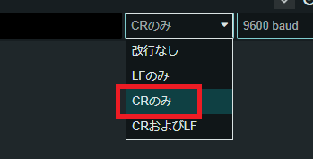

# cellular/transparent

セルラーモジュールをATコマンドの手入力で操作するスケッチです。

## 概要

セルラーモジュールの電源をオンして、シリアルモニタとセルラーモジュール透過的につなぎます。
シリアルモニタからの入力をセルラーモジュールへ送信し、セルラーモジュールからの受信をシリアルモニタに出力します。

シリアルモニタの改行コードは`CRのみ`を選択してください。

<a href="../../media/54.png"></a>

## ATコマンド例

* 初期化

    ```
    AT&F1           // 工場出荷時の設定に戻す
    AT+IFC=2,2      // ハードウェアフロー制御を有効化
    AT+QSCLK=2      // スリープモードを有効化
    ```

* ネットワークオペレーター

    ```
    AT+COPS=?       // 接続できるネットワークオペレーターを取得
    AT+COPS?        // 接続しているネットワークオペレーターを取得
    ```

* PDPコンテキストを設定

    ```
    AT+CGDCONT?                                         // PDPコンテキストを取得
        AT+CFUN=0                                       // 機能レベルを最小化
        AT+CGDCONT=1,"IP","soracom.io","0.0.0.0",0,0,0  // PDPコンテキストを設定
        AT+CFUN=1                                       // 機能レベルを最大化
    ```

* セルラーモジュールやSIMの情報

    ```
    AT+QGMR         // ファームウェアのレビジョンを取得
    AT+GSN          // IMEIを取得
    AT+CPIN?        // PIN状態を取得
    AT+CIMI         // IMSIを取得
    AT+QCCID        // ICCIDを取得
    AT+CNUM         // 電話番号を取得
    ```

* ネットワーク登録状態

    ```
    AT+CEREG?       // EPSネットワーク登録状態を取得
    AT+COPS?        // 接続しているネットワークオペレーターを取得
    AT+CGATT?       // パケットドメインサービスの状態を取得
    ```

* SORACOMメタデータサービスからタグをHTTP GET

    ```
    AT+QHTTPURL=45                  // HTTPのURLを設定(45バイト)
    http://metadata.soracom.io/v1/subscriber.tags
    AT+QHTTPGET                     // HTTP GET
    AT+QHTTPREAD                    // レスポンスを取得
    ```

* SORACOM HarvestへHTTP POST

    ```
    AT+QHTTPURL=25                  // HTTPのURLを設定(25バイト)
    http://harvest.soracom.io
    AT+QHTTPCFG="contenttype",1     // HTTPのContent-Typeをtext/plainに設定
    AT+QHTTPPOST=5                  // HTTP POST(5バイト)
    hello
    ```
