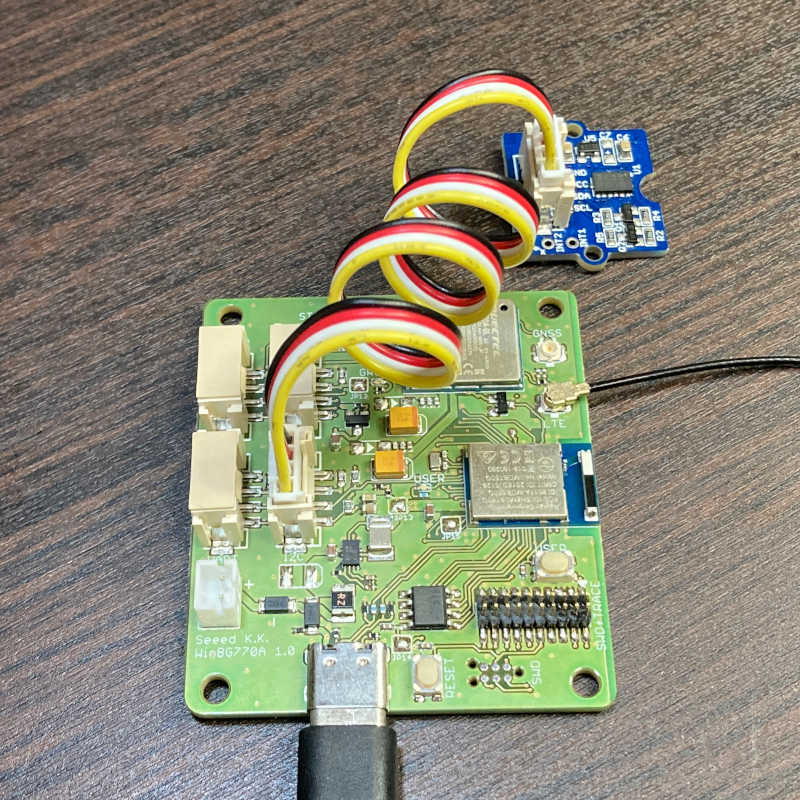
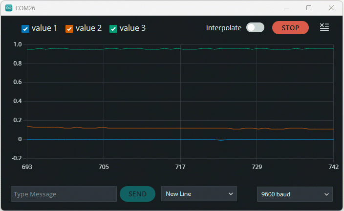

# grove/grove-accelerometer

加速度センサーの値をシリアルモニタに表示するスケッチです。

## 概要

このスケッチはGrove - I2Cの使用例です。
Grove - I2Cコネクタに接続した[Grove - ADXL345 - 3-Axis Digital Accelerometer(±16g)](https://www.seeedstudio.com/Grove-3-Axis-Digital-Accelerometer-16g.html)の加速度をシリアルモニタに表示します。
表示の周期は0.1秒です。

