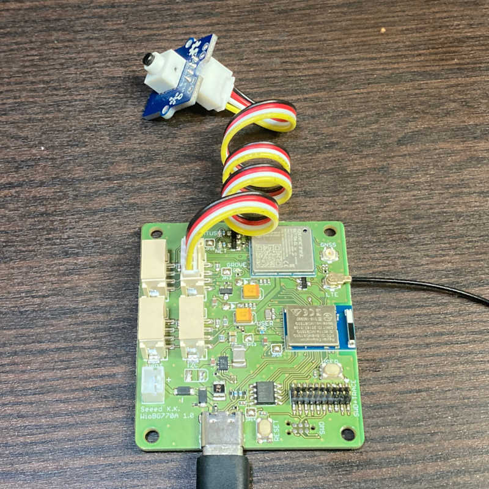
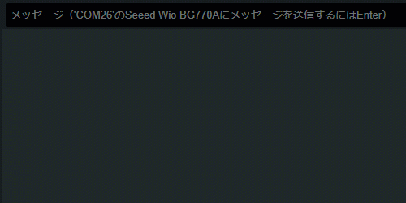

# grove/grove-button

ボタンのON/OFFをシリアルモニタに表示するスケッチです。

## 概要

このスケッチはGrove - Digitalの使用例です。
Grove - Digitalコネクタに接続した[Grove - Button](https://www.seeedstudio.com/Grove-Button.html)のプッシュ状態をシリアルモニタに表示します。
表示の周期は0.1秒です。

<a href="../../media/43.jpg"></a>

<a href="../../media/44.gif"></a>

## 詳細

WioCellular.hをインクルードして、WioCellularインスタンスを使えるようにします。

```cpp
#include <WioCellular.h>
```

セルラーモジュールとのインターフェースを初期化して、Groveの電源を投入します。

```cpp
WioCellular.begin();
digitalWrite(PIN_VGROVE_ENABLE, VGROVE_ENABLE_ON);
```

Grove - Buttonのピンを入力に設定します。

```cpp
pinMode(BUTTON_PIN, INPUT);
```

`digitalRead()`でボタンのプッシュ状態を取得します。

```cpp
int buttonState = digitalRead(BUTTON_PIN);
```
