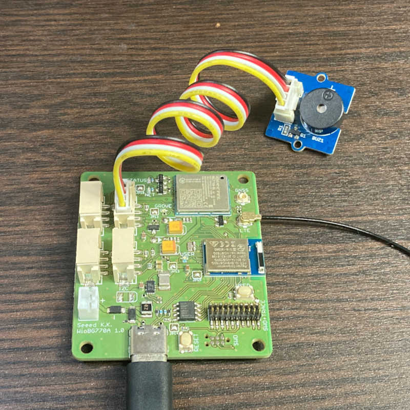

# grove/grove-buzzer

ブザーを鳴らすスケッチです。

## 概要

このスケッチはGrove - Digitalの使用例です。
Grove - Digitalコネクタに接続した[Grove - Piezo Buzzer/Active Buzzer](https://www.seeedstudio.com/Grove-Buzzer.html)でビープ音を鳴らします。
0.1秒間ビープ音、3秒間消音を繰り返します。



## 詳細

WioCellular.hをインクルードして、WioCellularインスタンスを使えるようにします。

```cpp
#include <WioCellular.h>
```

セルラーモジュールとのインターフェースを初期化して、Groveの電源を投入します。

```cpp
WioCellular.begin();
WioCellular.enableGrovePower();
```

Grove - Piezo Buzzer/Active Buzzerのピンを出力に設定します。

```cpp
digitalWrite(BUZZER_PIN, LOW);
pinMode(BUZZER_PIN, OUTPUT);
```

`digitalWrite()`でビープ音を鳴らしたり止めたりします。

```cpp
digitalWrite(BUZZER_PIN, HIGH);
delay(BUZZER_ON_TIME);

digitalWrite(BUZZER_PIN, LOW);
delay(BUZZER_OFF_TIME);
```
