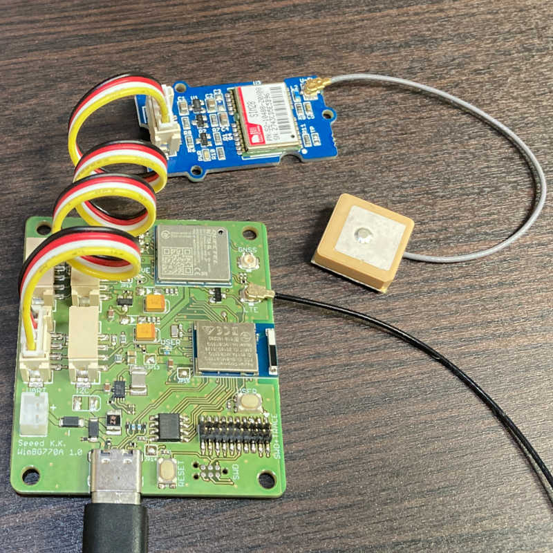
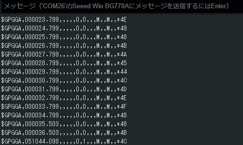

# grove/grove-gps

GPSの位置情報をシリアルモニタに表示するスケッチです。

## 概要

このスケッチはGrove - UARTの使用例です。
Grove - UARTコネクタに接続した[Grove - GPS Module](https://www.seeedstudio.com/Grove-GPS-Module.html)のGPS位置情報をシリアルモニタに表示します。

