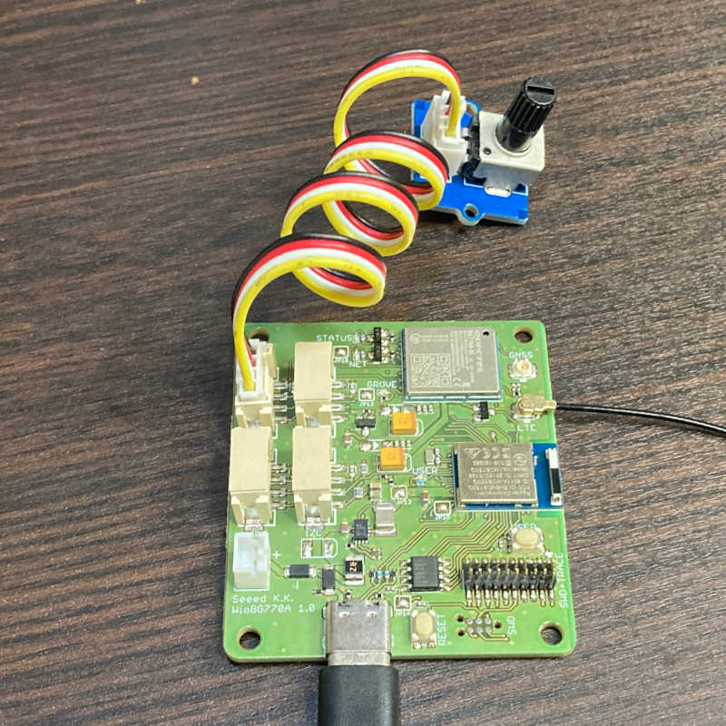
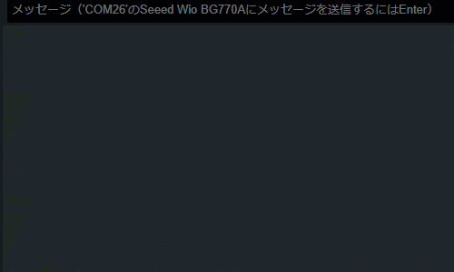

# grove/grove-rotary-angle-sensor

可変抵抗の回転量をシリアルモニタに表示するスケッチです。

## 概要

このスケッチはGrove - Analogの使用例です。
Grove - Analogコネクタに接続した[Grove - Rotary Angle Sensor](https://www.seeedstudio.com/Grove-Rotary-Angle-Sensor.html)のノブ回転位置をシリアルモニタに表示します。
表示の周期は0.5秒です。

<a href="../../media/45.jpg"></a>

<a href="../../media/46.gif"></a>

## 詳細

WioCellular.hをインクルードして、WioCellularインスタンスを使えるようにします。

```cpp
#include <WioCellular.h>
```

セルラーモジュールとのインターフェースを初期化して、Groveの電源を投入します。

```cpp
WioCellular.begin();
digitalWrite(PIN_VGROVE_ENABLE, LOW);
```

アナログ入力の分解能（ビット数）を14ビットに変更します。
(デフォルトは10ビットです。)

```cpp
analogReadResolution(14);
```

`analogRead()`で回転位置に対応した値を取得します。

```cpp
const auto rotaryAngleRaw = analogRead(ROTARY_ANGLE_PIN);
```

`analogRead()`の値はADコンバーターで、

1. アナログ入力の電圧を**ゲイン**で増幅
2. 増幅した電圧を**基準電圧**で指定した**分解能**のデジタルに変換

と計算されています。

ADコンバーターは、

* ゲイン ... 1/6
* 基準電圧 ... 0.6V
* 分解能 ... 14ビット

と設定されているので、次の計算でアナログ入力をアナログ入力電圧に換算します。

```cpp
const auto rotaryAngleVoltage = (float)rotaryAngleRaw / 16383 * 0.6f / (1.0f / 6);
```

そして、横棒グラフの長さを計算しやすいように、アナログ入力電圧0~3.3Vを0~1に正規化します。

```cpp
const auto rotaryAngle = rotaryAngleVoltage / 3.3f;
```
