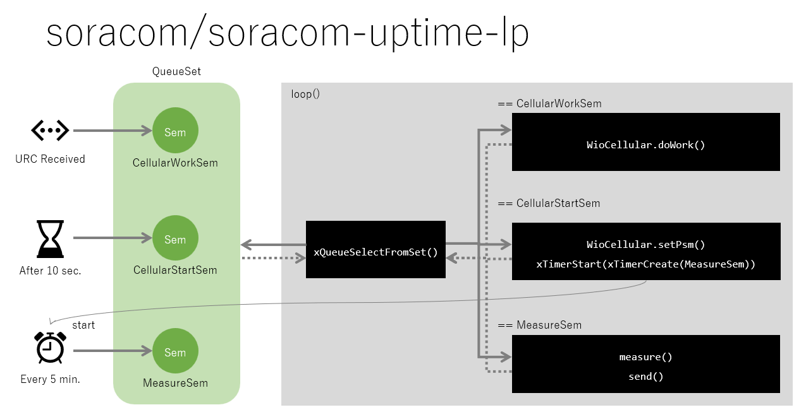

# soracom/soracom-uptime-lp

PSM機能を使った省電力のスケッチです。
稼働時間をSORACOM Unified Endpointへ送信します。

## 概要

5分周期に、稼働時間をSORACOM Unified Endpointへ送信します。
送信しない間はPSM機能で電力消費を抑止します。

## 詳細

省電力を実現するために、セルラー通信のPSMとイベント駆動型プログラミングを使っています。

### PSM

待機時にPSM機能でセルラーモジュールの電源をほぼオフしています。

PSMのスリープからの復帰要因はPSMの周期時間(periodic TAU)とCPUによるウェイクアップが使えますが、ここではCPUによるウェイクアップを使っています。
測定周期(MEASURE_PERIOD)よりも長い時間をPSM周期時間(PSM_PERIOD)に設定しています。

```cpp
static constexpr int MEASURE_PERIOD = 1000 * 60 * 5;  // [ms]
static constexpr int PSM_PERIOD = 60 * 6;             // [s]
```

`WioCellular.setPsm()`でPSMを有効にします。

```cpp
ABORT_IF_FAILED(WioCellular.setPsm(1, PSM_PERIOD, PSM_ACTIVE));
```

### イベント駆動型プログラミング

スピンループで電力を消費しないために、セマフォを使ったイベント駆動型プログラミングで作られています。



3つのセマフォを、

```cpp
assert(CellularWorkSem = WioCellular.getInterface().getReceivedNotificationSemaphone());
assert(CellularStartSem = xSemaphoreCreateBinary());
assert(MeasureSem = xSemaphoreCreateBinary());
```

同時に待機できるように、QueueSetを使います。

```cpp
assert(QueueSet = xQueueCreateSet(3));
assert(xQueueAddToSet(CellularWorkSem, QueueSet) == pdPASS);
assert(xQueueAddToSet(CellularStartSem, QueueSet) == pdPASS);
assert(xQueueAddToSet(MeasureSem, QueueSet) == pdPASS);
```

そして、`loop()`でQueueSetを待機して、セマフォに応じた処理を実行します。

* CellularWorkSemセマフォ

    セルラーモジュールから受信したときのイベントです。
    セルラーモジュールのURC処理を実行します。

* CellularStartSemセマフォ

    起動してから10秒後に発生するイベントです。
    PSM機能の設定と測定タイマの開始を行います。

* MeasureSemセマフォ

    測定タイマ(5分周期)のイベントです。
    稼働時間の取得とSORACOM Unified Endpointへの送信を行います。

```cpp
const auto activatedMember = xQueueSelectFromSet(QueueSet, portMAX_DELAY);
if (activatedMember == CellularWorkSem) {
assert(xSemaphoreTake(activatedMember, 0) == pdTRUE);
...
} else if (activatedMember == CellularStartSem) {
assert(xSemaphoreTake(activatedMember, 0) == pdTRUE);
...
} else if (activatedMember == MeasureSem) {
assert(xSemaphoreTake(activatedMember, 0) == pdTRUE);
...
}
```
