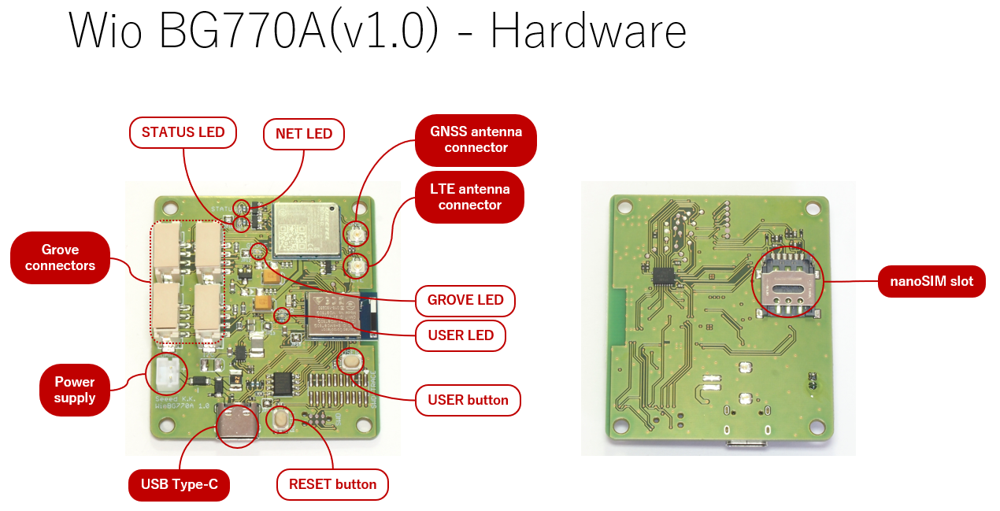
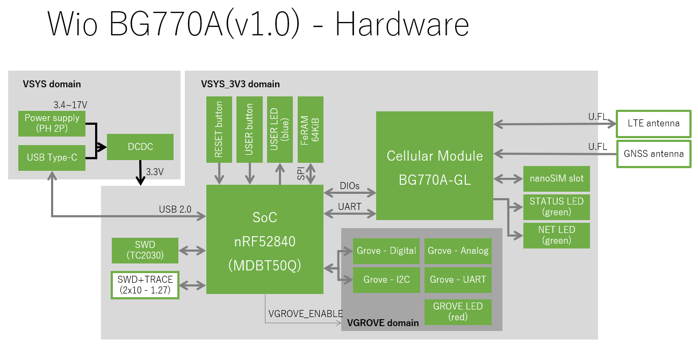
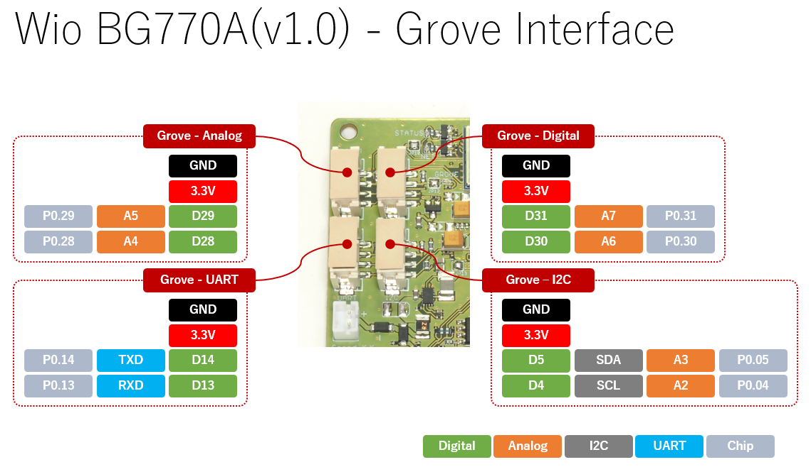
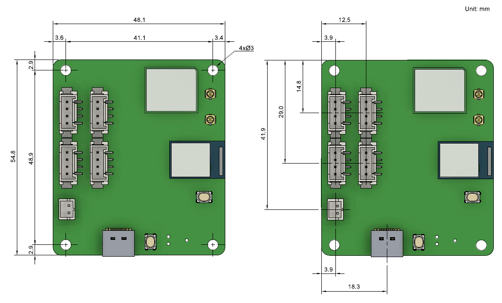

# Wio BG770A ハードウェアマニュアル

## 機能

### LEDとボタン

#### RESETボタン

RESETボタンはCPUのリセットとDFUモードの起動に使います。

RESETボタンをクリックするとCPUがハードウェアリセットされて再起動します。
(セルラーモジュールはリセットされません。通常、アプリケーションは起動時にセルラーモジュールをリセットします。)

RESETボタンをダブルクリックするとDFUモードで起動します。(工場出荷時に書き込まれているブートローダーの振る舞いです。)

#### USER LEDとUSERボタン

USER LEDとUSERボタンは、あなたのアプリケーションで自由に使えるユーザーインターフェースです。

#### STATUS LEDとNET LED

STATUS LEDとNET LEDはセルラーモジュールの状態を示します。

STATUS LEDはセルラーモジュールが電源オンして動作しているときに点灯します。

|STATUS LED|動作状態|
|:--|:--|
|点灯|セルラーモジュール動作中|
|消灯|セルラーモジュール停止中|

NET LEDはLTEネットワークへの動作状態を示します。

|NET LED (点灯時間/消灯時間[ミリ秒])|動作状態|
|:--|:--|
|200/1800|探索中|
|1800/200|待機|
|125/125|通信中|

#### GROVE LED

GROVE LEDはGroveインターフェースの電源供給状態を示します。
電源を投入しているときに点灯します。

|GROVE LED|電源供給状態|
|:--|:--|
|点灯|Groveの電源投入|
|消灯|Groveの電源開放|

### Groveインターフェース

Wio BG770Aは4つのGroveインターフェースを持っています。
一般的にはコネクタの名称と同じインターフェース機能を使いますが、別の機能を使うことも出来ます。
(たとえばGrove - I2CはI2Cインターフェースで使うのが一般的ですが、デジタル入出力で使うことも可能です。)

|Groveコネクタ名称|デジタル入出力|アナログ入力|I2C|UART|
|:--|:--|:--|:--|:--|
|Grove - Digital|**Y**|Y|n|n|
|Grove - Analog|Y|**Y**|n|n|
|Grove - I2C|Y|Y|**Y**|n|
|Grove - UART|Y|n|n|**Y**|

### 電源

Wio BG770Aの電源はUSB Type-Cもしくは電源コネクタから供給します。

Wio BG770Aの内部では、電源は3つのドメインに分かれていて、そのうち1つはCPUで電源の投入、開放を操作できます。

|電源ドメイン|電圧[V]|供給範囲|投入条件|
|:--|:--|:--|:--|
|VSYS|3.4(*1)~17|VSYS_3V3|なし|
|VSYS_3V3|3.3|CPU、セルラーモジュール、(VGROVE)|なし|
|VGROVE|3.3|Groveインターフェース|VGROVE_ENABLE信号|

*1: Groveインターフェースの消費電流が多いと、必要な最低電圧は大きくなります。

## 仕様

|Item|Value|
|:--|:--|
|CPU|Arm Cortex-M4 with FPU, 64MHz|
|フラッシュメモリ|1MiB (CPU内蔵)|
|SRAM|256KiB (CPU内蔵)|
|FeRAM|64KiB|
|ワイヤレス|Bluetooth 5 IEEE 802.15.4-2006|
|セルラー|LTE Cat.M1 LTE Cat.NB1 **NOTE:** GNSSとセルラーは排他で機能します。|
|&emsp;バンド (LTE Cat.M1)|B1,B2,B3,B4,B5,B8,B12,B13,B18,B19,B20,B25,B26,B27,B28,B66|
|&emsp;バンド (LTE Cat.NB1)|B1,B2,B3,B4,B5,B8,B12,B13,B17,B18,B19,B20,B25,B28,B66|
|&emsp;キャリア|NTTドコモ KDDI|
|GNSS|GPS GLONASS **NOTE:** GNSSとセルラーは排他で機能します。|
|LED|USER LED (青色) STATUS LED (緑色) NET LED (緑色) GROVE LED (赤色)|
|ボタン|USERボタン RESETボタン|
|SIMスロット|nanoSIM|
|LTEアンテナコネクタ|U.FL|
|GNSSアンテナコネクタ|U.FL|
|Groveインターフェース|x1 Grove - Digital x1 Grove - Analog x1 Grove - I2C x1 Grove - UART **NOTE:** 全て3.3Vです。5Vには対応していません。|
|USBインターフェース|x1 USB Type-C USB 2.0 Full Speed (**NOTE:** 電源コネクタと兼用です。)|
|デバッグインターフェース|SWD (Tag-Connect TC2030-*-NL with TC2030-CLIP) SWD+Trace (2x10 1.27mm SMT header)
|電源コネクタ|USB Type-C (**NOTE:** USBインターフェースと兼用です。) [JST PHコネクタ](https://www.jst-mfg.com/product/index.php?series=199) 2pin (3.4(*1)~17V DC)|
|消費電力|**(TBC)**|
|寸法|49 x 55 x 13 mm|

*1: Groveインターフェースの消費電流が多いと、必要な最低電圧は大きくなります。

### 寸法

## 資料

* [回路図(v1.0)](media/WioBG770A.v1.0.pdf)
