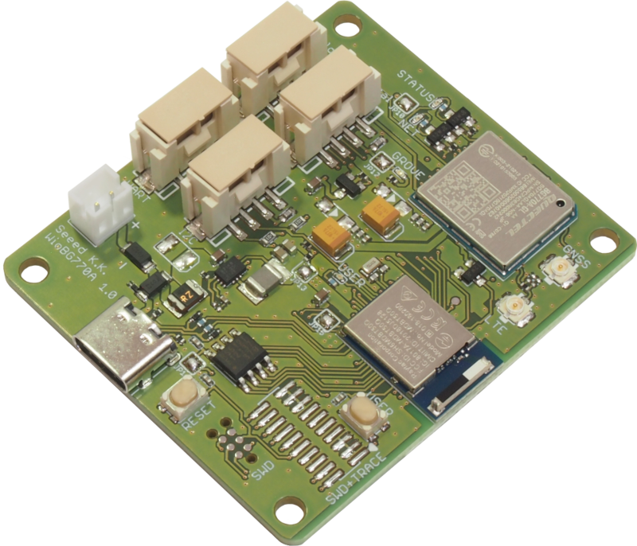

# Wio BG770A

<a href="media/24.png"><a>

Wio BG770Aは、**低消費電力セルラーIoTデバイス開発ボード**です。
多くの開発ボードと比べて、これらの特徴があります。

|Feature|Description|
|:--|:--|
|マイコン搭載|ユーザーが独自にプログラミングできるマイコンを搭載しています。|
|Grove|Groveコネクタを4つ備えており、センサーやアクチュエータなどのGroveモジュールを簡単に接続できます。|
|セルラー通信|LTE Cat.M1やLTE Cat.NB1をサポートし、複数のキャリア(NTTドコモとKDDI)に対応しています。|
|データの保存|高速で高信頼性の不揮発性メモリ(FeRAM)を使用して、データを一時的に保存できます。|
|スマートフォンとの通信|Bluetoothを搭載しており、スマートフォンとの連携が可能です。|
|ジオロケーション|GNSS(Global Navigation Satellite System)を利用して位置情報を取得できます。|
|プログラミングとデバッギング|Arduino IDEを使用してプログラムを書き、USBからマイコンのフラッシュメモリへ書き込むことができます。また、市販のデバッグアダプタを使って高機能なデバッギングも可能です。|
|省電力|LTE通信の省電力機能(eDRX/PSM)をサポートしています。また、マイコンからGroveの電源供給をカットして電力消費を抑止することができます。|
|電池駆動|PHコネクタを介して乾電池や塩化チオニルリチウム電池、LiPoバッテリーでデバイスを運用できます。|

* マニュアル
    * [ユーザーマニュアル](user-manual.md)
    * [ハードウェアマニュアル](hardware.md)
    * [ナレッジベース](knowledgebase.md)
    * [WioCellularライブラリ リファレンスマニュアル](https://seeedjp.github.io/wio_cellular/)
* サンプル
    * [サンプルスケッチ](examples.md)
    * [GitHub . SORACOM UG 四国 x kintone Café 高知 Vol.22 SORACOMハンズオンソース](https://github.com/banauo/soracom_ug_202506) . banauo
* アプリケーションノート
    * [セルラー関連情報](cellular.md)
    * [消費電力](power-consumption.md)
* 記事
    * [GitHub . Recipes for Wio BG770A](https://github.com/SeeedJP/wio_bg770a_recipes) . SeeedJP
    * [note . Wio BG770Aの研究](https://note.com/susa_lab/m/m2207f165ba87) . 高知のIoT屋
    * [Zenn . Wio BG770AをSORACOM Airでつないでみる](https://zenn.dev/showm001/articles/2024-12-01-01) . しょーちゃん
    * [note . Wio BG770Aへの道①検証前の準備](https://note.com/anysonica/n/n4b74dfc93ce0) . anysonica
    * [note . Wio BG770Aへの道②　乾電池で駆動するGPSユニットをつくる](https://note.com/anysonica/n/n7c6efc6c35a7) . anysonica
    * [note . WioBG770Aへの道③超音波距離センサー＋乾電池駆動＋PSM](https://note.com/anysonica/n/n7c99611a1a4c) . anysonica
    * [Zenn . Wio BG770AのATコマンドを確認する](https://zenn.dev/matsujirushi/articles/474d1de60c7c9b) . matsujirushi
    * [Zenn . Wio BG770Aのサンプルスケッチぶらり旅](https://zenn.dev/matsujirushi/articles/7a1de046f5f05b) . matsujirushi
    * [Hatena Blog . 【世界初】Wio BG770AをSeeed社員に教えてもらってチョットワカル気になってみた【発売記念】](https://uepon.hatenadiary.com/entry/2024/12/19/000000) . ueponx
    * [Hatena Blog . Wio BG770Aでミニサイネージを作ってみた](https://supernove.hatenadiary.jp/entry/2024/12/21/235847) . KMiura
    * [aadojo . arduino-cliとGitHub Actions self hosted runnerを使ってマイコン開発でもCI/CDを実現する](https://aadojo.alterbooth.com/entry/2024/12/22/111610) . showm001
    * [Qiita . Arduino IDEで簡単に始めるSeeedStudio製 Wio BG770A のはじめの一歩](https://qiita.com/yukima77/items/e45a44720cd7fffade3d) . yukima77
    * [Qiita . SeeedStudio製 Wio BG770AとSORACOM SIMで試す！簡単セルラー通信](https://qiita.com/yukima77/items/45793e72b2347ecbb18b) . yukima77
    * [Qiita . Wio BG770Aで使ってみるM5Stack用環境光センサユニット！その方法とは？](https://qiita.com/yukima77/items/aaf8ff2a3fd9249c8f4b) . yukima77
    * [Qiita . Wio BG770Aで割り込み処理を実装する方法](https://qiita.com/yukima77/items/536867589f62a82ef480) . yukima77
    * [Qiita . Wio BG770Aの省電力化！delay関数で驚きの実現!?](https://qiita.com/yukima77/items/7b9f3947890b486dff8b) . yukima77
    * [Qiita . 低消費電力開発ボードWio BG770Aで試す低容量向けプリペイド型IoTSIMカード1NCE](https://qiita.com/yukima77/items/bcbf2ff5e222a6e40a7b) . yukima77
    * [Qiita . Wio BG770Aで使うCO2センサ：Sensirion製SCD41の実装方法](https://qiita.com/yukima77/items/03144936684ed58af6d2) . yukima77
    * [Qiita . 低消費電力開発ボードWio BG770Aで試す！Grove E-Inkディスプレイ1.54"](https://qiita.com/yukima77/items/f0384929dd114c5e1858) . yukima77
    * [FabScene . Seeed Studio Wio BG770A レビュー｜SORACOM & Groveモジュールで手軽につくる、省電力IoTの実力とは](https://fabscene.com/new/pr/wio-bg770a-review-pr-soracom-grove) . 淺野義弘
* 動画
    * [YouTube . Seeed Studio新製品 Wio BG770Aを徹底解説。仕様や使い勝手、開発秘話など盛りだくさん！ [IBUKA LAB 025]](https://www.youtube.com/watch?v=8g5Je8jlzi8) . IBUKA LAB.
* 資料
    * [Docswell . 新製品Wio BG770AはWio LTE Cat.1と何が違うのか？](https://www.docswell.com/s/matsujirushi/ZEX737-2025-04-12-213741) . matsujirushi
    * [Docswell . Wio BG770A ファーストタッチの前に](https://www.docswell.com/s/matsujirushi/Z3G1ED-2025-06-07-152612) . matsujirushi
    * [Docswell . 25-06-07 Wio BG770A：LTE-M対応通信モジュールの新たな選択肢](https://www.docswell.com/s/5779738433/K7R248-2025-06-07-180000) . T.SUSAMI
