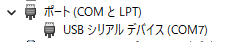
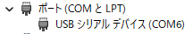

# KB3 スケッチ書き込み時とアプリケーション実行中でCOM番号が違う

## 事象

スケッチを書き込むためにDFUモードにしたときと、書き込んだアプリケーションが実行しているときで、PCに認識されるUSBのCOM番号が違う。

例:

* スケッチ書き込み時 ... COM7

  

* アプリケーション実行中 ... COM6

  

## 原因

これは正しい動作です。
ブートローダーに含まれているUSB-CDCの設定と、アプリケーションに含まれているUSB-CDCの設定が異なるためです。
