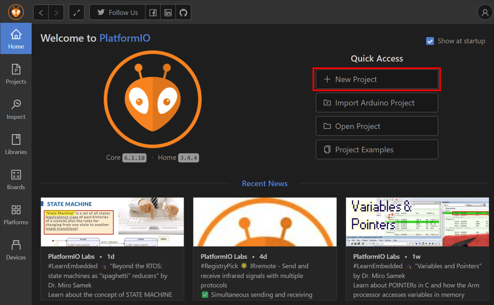
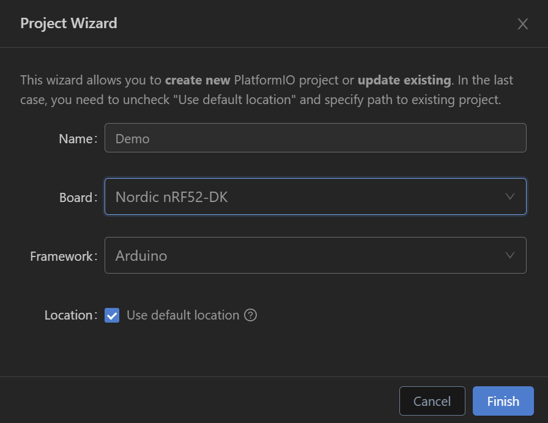
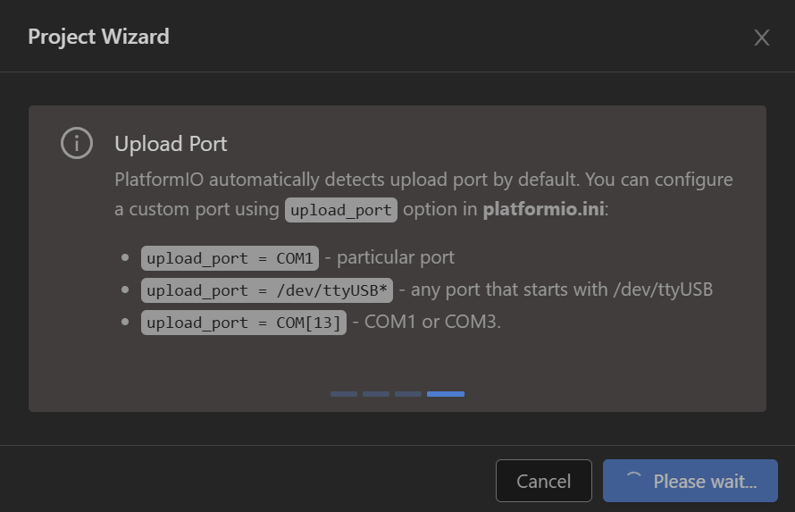
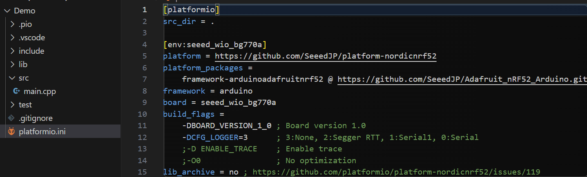
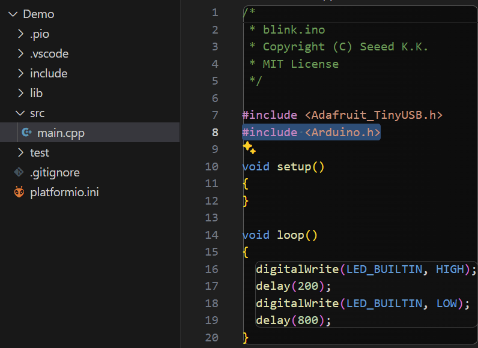

# KB5 VSCode+PlatformIOでの開発のはじめかた

[ユーザーズマニュアル](https://seeedjp.github.io/Wiki/Wio_BG770A/user-manual.html)では開発環境にArduinoIDEを用いています。  
しかし、ArduinoCoreを用いた開発環境として[Visual Studio Core(以下VSCode)](https://code.visualstudio.com/)+[PlatformIO](https://platformio.org/)を用いている方も少なからずいらっしゃるので、その場合の開発のはじめかたをまとめます。

## 前提条件

開発マシンにVSCodeのインストール及びPlatformIOの導入が終わっており、PlatformIOでプログラム作成経験があることを前提とします。  
この例で用いた環境は下記のとおりです。  

- OS:Windows 11 Home(バージョン:24H2)
- VSCode:1.103.1
- PlatformIO:Core 6.1.18 Home 3.4.4

## 1.プロジェクトの作成

はじめにプロジェクトの作成を行います。  
PlatformIOの「New Project」をクリックします。

  <a href="../media/57.png"></a>

Project Wizardを入力します。  
Nameは任意、Boardは"Nordic nRF52-DK"、Frameworkは"Arduino"を選び「Finish」ボタンをクリックします。

  <a href="../media/58.png"></a>  

Project Wizardにより、プロジェクトが生成されます。

  <a href="../media/59.png"></a>

## 2.プロジェクトの編集

platformio.iniに[blinkサンプルのplatformio.ini](https://github.com/SeeedJP/wio_cellular/blob/main/examples/basic/blink/platformio.ini)の内容をコピー&ペーストします。

  <a href="../media/60.png"></a>

platformio.iniに[blinkサンプルのblink.ino](https://github.com/SeeedJP/wio_cellular/blob/main/examples/basic/blink/blink.ino)の内容をコピー&ペーストします。   
このままだとコンパイルが通らないので、

```cpp
#include <Arduino.h>
```

を"#include <Adafruit_TinyUSB.h>"の後に入れましょう。

  <a href="../media/61.png"></a>

これでWio BG770Aの開発が可能です。お疲れ様でした。  
その後の書き込みなどは[ユーザーズマニュアル](https://seeedjp.github.io/Wiki/Wio_BG770A/user-manual.html)の「2-2. スケッチを書き込む」を参考にしてください。

### プロジェクト作成時にboardに"Wio BG770A"を指定したらどうなる？

PlatformIOのplatformで"https://github.com/SeeedJP/platform-nordicnrf52"をインストールし、Project WizardのBoardで"Wio BG770A(Seeed)"を指定すればスマートにプロジェクト作成できるように見えますが、Project Wizardの生成時にうまく生成されずいつまでも完了しませんのでご注意ください。