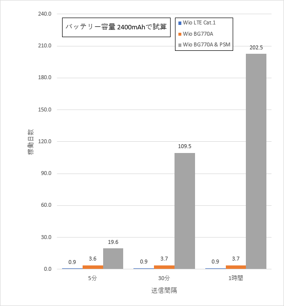
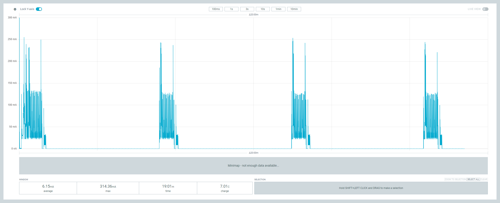
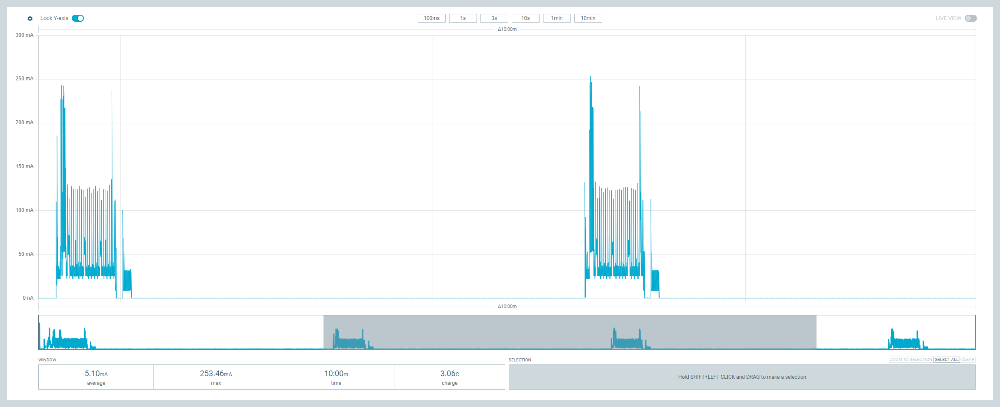
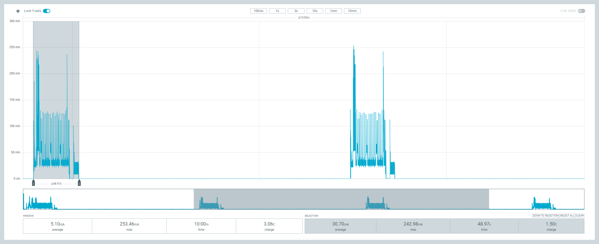
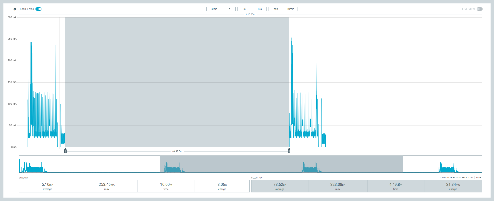
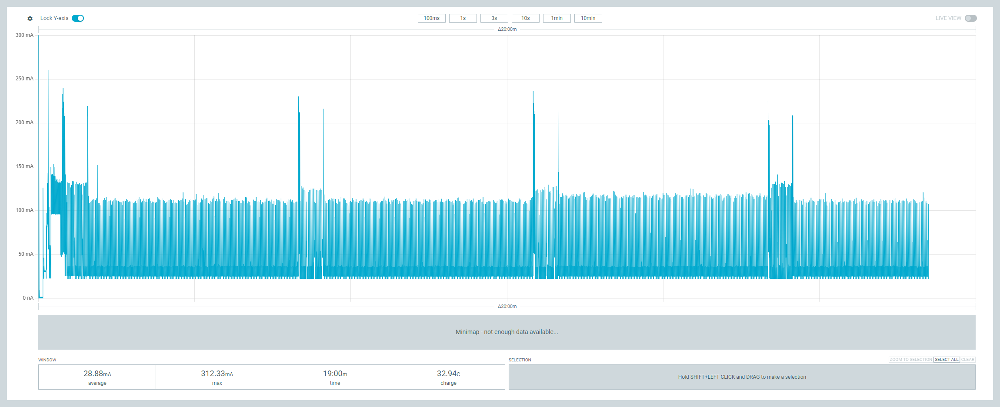
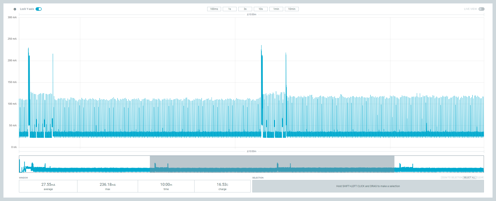
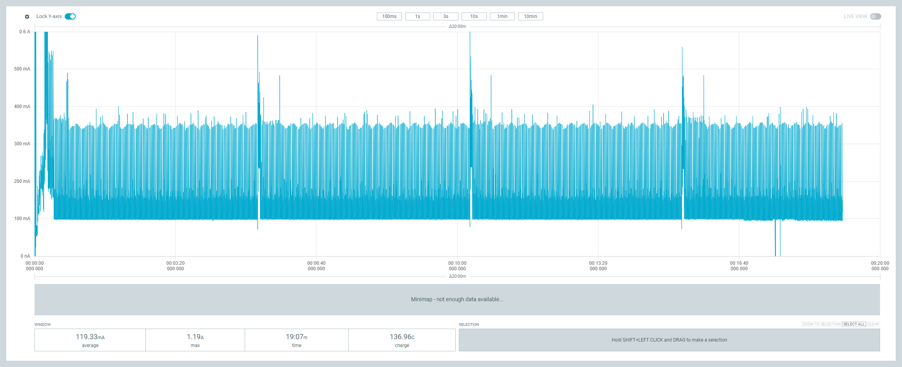
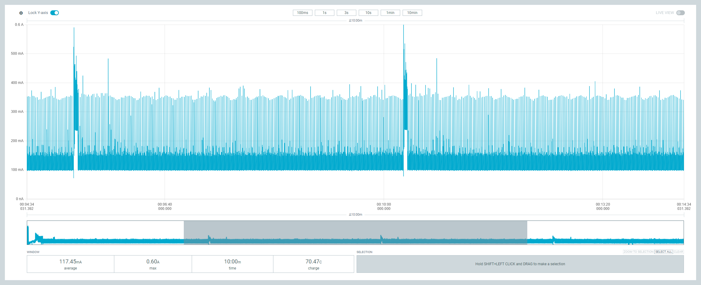

## Wio BG770A 消費電力

### 詳細

#### v1.0

* ハードウェア ... v1.0
* 電源電圧 ... 3.7V
* ソフトウェア ... [soracom/soracom-uptime-psm](https://github.com/SeeedJP/wio_cellular/tree/main/examples/soracom/soracom-uptime-psm)
* PSM使用

|処理|平均電流|最大電流|処理時間|
|:--|:--|:--|:--|
|接続|35mA|314mA|68秒|
|待機①|**74uA**|317uA|290秒|
|送信①|**31mA**|243mA|**48秒**|
|待機②|**74uA**|323uA|290秒|
|送信②|**32mA**|253mA|**47秒**|
|待機③|**74uA**|334uA|291秒|
|送信③|**33mA**|244mA|**47秒**|

#### v1.0 - PSM off

* ハードウェア ... v1.0
* 電源電圧 ... 3.7V
* ソフトウェア ... [soracom/soracom-uptime](https://github.com/SeeedJP/wio_cellular/tree/main/examples/soracom/soracom-uptime)
* PSM未使用

|処理|平均電流|最大電流|処理時間|
|:--|:--|:--|:--|
|接続|59mA|260mA|58秒|
|待機①|**27mA**|152mA|269秒|
|送信①|**35mA**|230mA|**32秒**|
|待機②|**26mA**|118mA|269秒|
|送信②|**37mA**|236mA|**33秒**|
|待機③|**27mA**|125mA|267秒|
|送信③|**36mA**|225mA|**32秒**|

#### Wio LTE Cat.1 - PSM off

* ハードウェア ... Wio LTE Cat.1
* 電源電圧 ... 3.7V
* ソフトウェア ... [soracom/soracom-unified](https://github.com/SeeedJP/WioLTEforArduino/tree/main/examples/soracom/soracom-unified)
* PSM未使用

|処理|平均電流|最大電流|処理時間|
|:--|:--|:--|:--|
|接続|179mA|1200mA|47秒|
|待機①|**115mA**|401mA|270秒|
|送信①|**140mA**|600mA|**32秒**|
|待機②|**115mA**|395mA|270秒|
|送信②|**141mA**|600mA|**31秒**|
|待機③|**115mA**|406mA|271秒|
|送信③|**139mA**|600mA|**32秒**|

