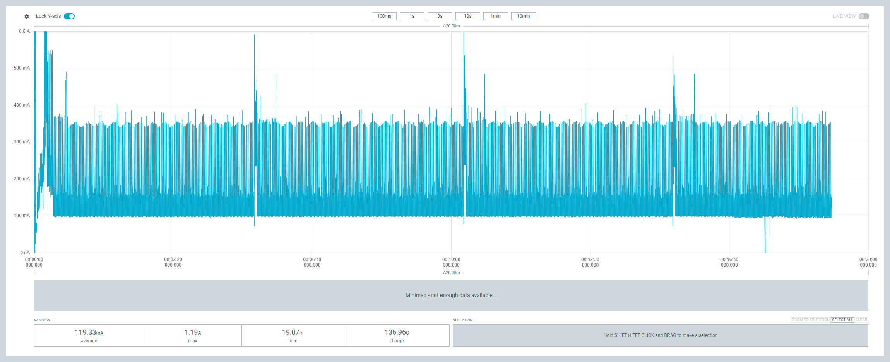

## Wio BG770A 消費電力

### 詳細

#### v1.0

* ハードウェア ... v1.0
* 電源電圧 ... 3.7V
* ソフトウェア ... soracom/soracom-uptime-unified-lp
* PSM使用

|処理|平均電流|最大電流|処理時間|
|:--|:--|:--|:--|
|接続|31mA|296mA|66秒|
|待機①|**75uA**|5mA|265秒|
|送信①|**27mA**|234mA|**49秒**|
|待機②|**74uA**|5mA|252秒|
|送信②|**26mA**|255mA|**49秒**|
|待機③|**74uA**|5mA|252秒|
|送信③|**27mA**|267mA|**50秒**|

#### v1.0 - PSM off

* ハードウェア ... v1.0
* 電源電圧 ... 3.7V
* ソフトウェア ... soracom/soracom-uptime-unified-lp
* PSM未使用

|処理|平均電流|最大電流|処理時間|
|:--|:--|:--|:--|
|接続|32mA|302mA|54秒|
|待機①|**22mA**|124mA|277秒|
|送信①|**32mA**|232mA|**32秒**|
|待機②|**22mA**|123mA|269秒|
|送信②|**31mA**|232mA|**33秒**|
|待機③|**22mA**|276mA|268秒|
|送信③|**32mA**|226mA|**33秒**|

#### Wio LTE Cat.1 - PSM off

* ハードウェア ... Wio LTE Cat.1
* 電源電圧 ... 3.7V
* ソフトウェア ... soracom/soracom-unified
* PSM未使用

|処理|平均電流|最大電流|処理時間|
|:--|:--|:--|:--|
|接続|179mA|1200mA|47秒|
|待機①|**115mA**|401mA|270秒|
|送信①|**140mA**|600mA|**32秒**|
|待機②|**115mA**|395mA|270秒|
|送信②|**141mA**|600mA|**31秒**|
|待機③|**115mA**|406mA|271秒|
|送信③|**139mA**|600mA|**32秒**|

