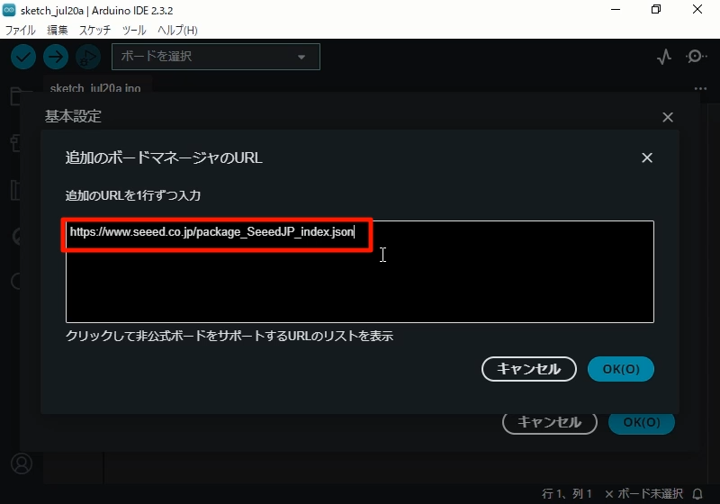
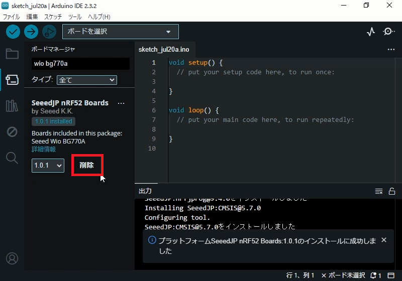
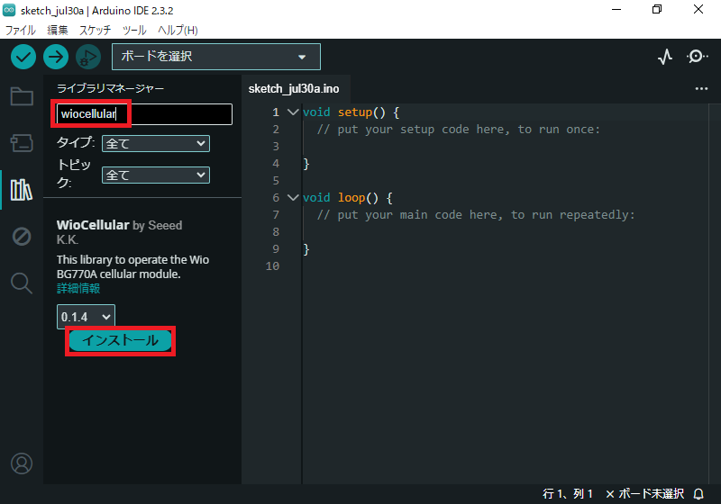
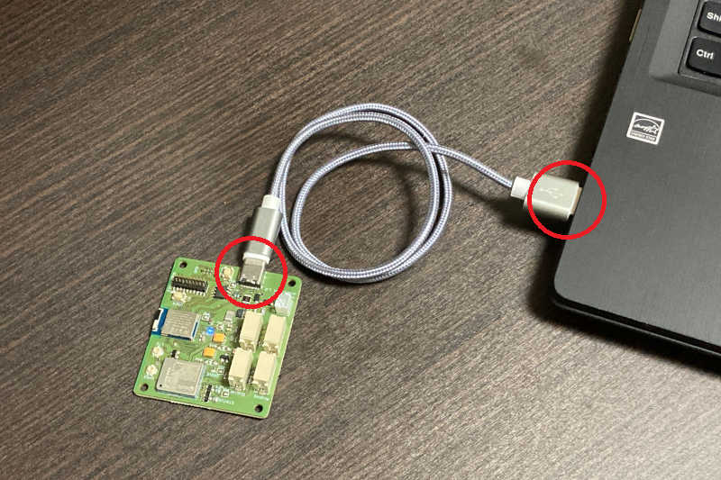
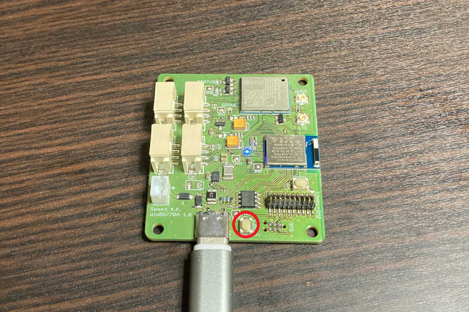
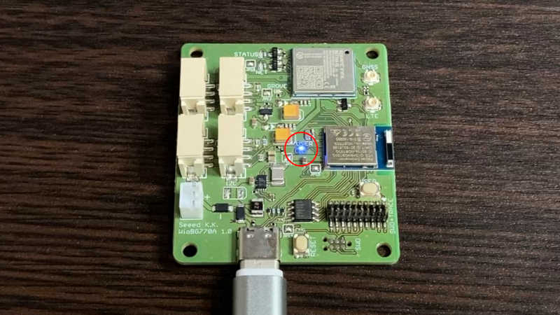
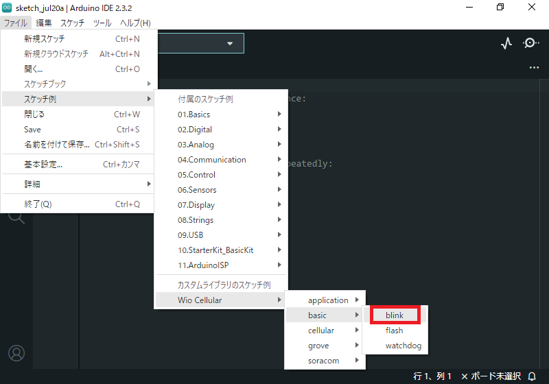
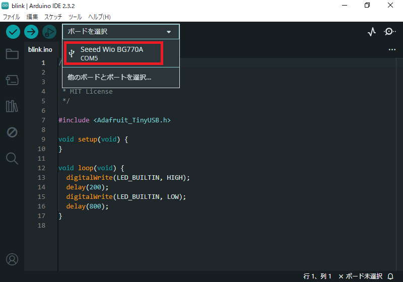
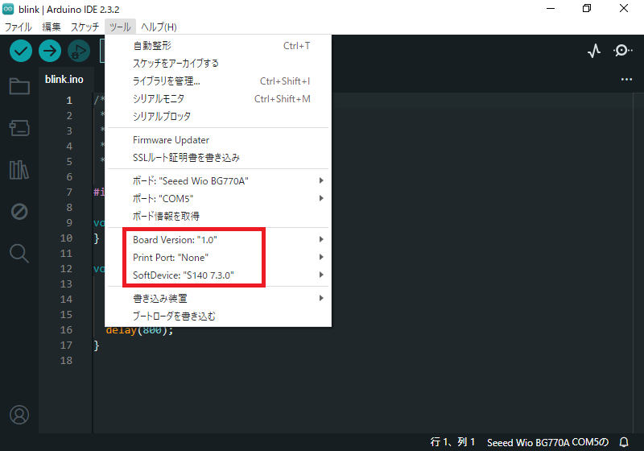
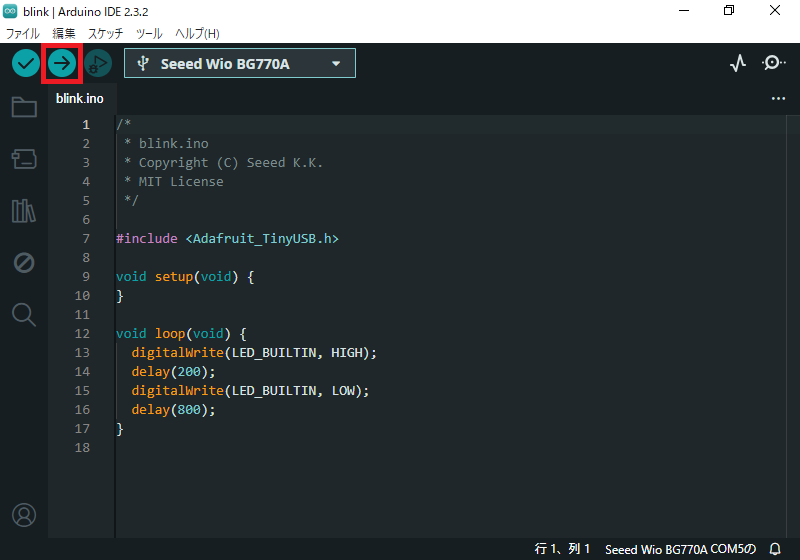

# Wio BG770A クイックスタートガイド

## 開発環境

Wio BG770Aを開発するには、PCに3つのソフトウェアをインストールする必要があります。

* Arduino IDE

    統合開発環境です。
    コードの編集、コンパイル、Wio BG770Aへアップロード、Wio BG770Aのモニタリングが1つのソフトウェアで出来ます。

* SeeedJP nRF52 Boards

    Wio BG770A用のコンパイラや基本ライブラリが含まれているボードサポートパッケージです。
    Arduino IDEは標準ではArduino公式ボードしか対応していませんが、このボードサポートパッケージをインストールすると、Wio BG770Aの開発が出来るようになります。

* WioCellular

    セルラーモジュールを操作するライブラリです。
    このライブラリを利用すると自らコーディングするよりも短期間でセルラー通信を実現できます。

### 手順1: Arduino IDEをインストール

ArduinoのWebサイト(https://www.arduino.cc/en/software)からArduino IDEをダウンロードしてPCにインストールしてください。
インストールの手順はArduinoの「Downloading and installing the Arduino IDE 2」(https://docs.arduino.cc/software/ide-v2/tutorials/getting-started/ide-v2-downloading-and-installing/)にあります。

### 手順2:SeeedJP nRF52 Boardsをインストール

-> 動画([Install SeeedJP nRF52 Boards.mp4](media/Install%20SeeedJP%20nRF52%20Boards.mp4))

Arduino IDEからSeeedJP nRF52 Boardsを探し出せるよう、ボードサポートパッケージインデックスのURLをArduino IDEに登録します。
Arduino IDEの基本設定画面(メニューの「ファイル」>「基本設定」)を開いて、「追加のボードマネージャのURL」に`https://www.seeed.co.jp/package_SeeedJP_index.json`を追加してください。

次に、Arduino IDEにSeeedJP nRF52 Boardsをインストールします。ボードマネージャ画面で`wio bg770a`を検索して、一覧に表示された「SeeedJP nRF52 Boards by Seeed K.K.」のところにある「インストール」をクリックしてください。

正常にインストールされると「インストール」の表示が「削除」に変わります。

### 手順3: WioCellularをインストール

ライブラリマネージャー画面で`wiocellular`を検索して、一覧に表示された「WioCellular by Seeed K.K.」のところにある「インストール」をクリックしてください。

正常にインストールされると「インストール」の表示が「削除」に変わります。

## スケッチを書き込む

### 手順1: PCにWio BG770Aを接続

PCとWio BG770AをUSBケーブルで接続してください。

### 手順2: DFUモードに切替

-> 動画([Switch to DFU mode.mp4](media/Switch%20to%20DFU%20mode.mp4))

RESETボタンをダブルクリックしてください。
DFUモードに切り替わると、USER LEDがフワフワと点滅してPCに`BOOT`というボリューム名のドライブが表示されます。

### 手順3: blinkスケッチをアップロード

-> 動画([Write sketch.mp4](media/Write%20sketch.mp4))

blinkスケッチを開きます。
Arduino IDEのメニュー「ファイル」>「スケッチ例」>「Wio Cellular」>「basic」>「blink」を選んでください。
すると、blinkスケッチのArduino IDEウィンドウが起動します。
元のArduino IDEウィンドウは閉じてください。

ボードをWio BG770Aに切り替えます。
画面上部のボード選択欄で「Seeed Wio BG770A COMx」を選んでください。
一覧にSeeed Wio BG770Aが表示されないときは、DFUモードに切り替えができていない可能性が高いです。
手順2を確認してください。

ボードのオプションを設定します。
Arduino IDEのメニュー「ツール」配下に表示されている下記項目を設定してください。

* Board Version ... "1.0"
* Print Port ... "None"
* SoftDevice ... "S140 7.3.0"

blinkスケッチをコンパイルして、Wio BG770Aへ書き込みます。
書き込みボタンをクリックしてください。

正しく書き込みできると、USER LEDが点滅します。(0.2秒点灯/0.8秒消灯)

