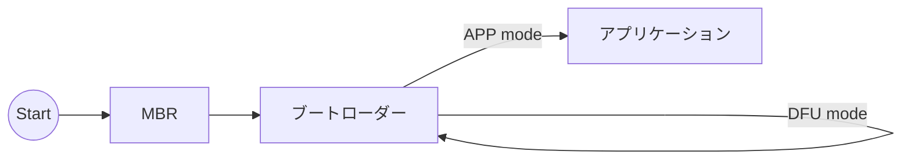
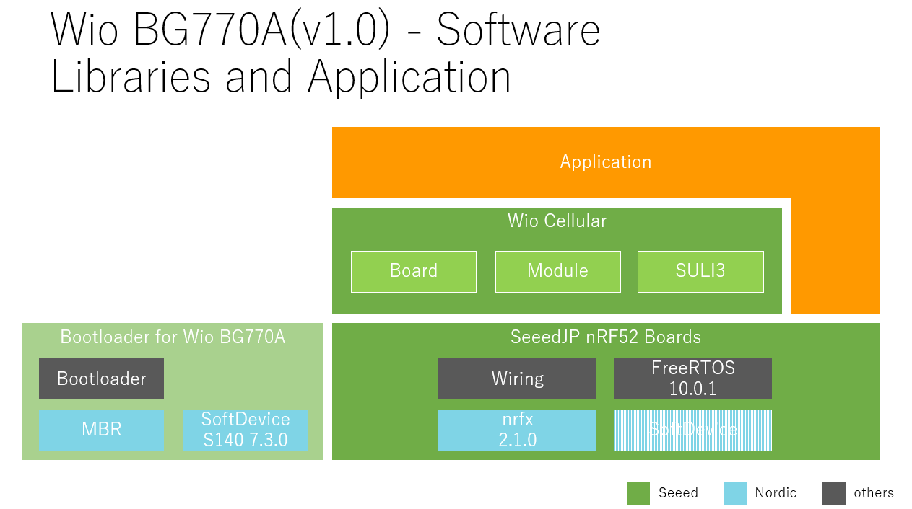

# Wio BG770A ソフトウェアマニュアル

## 3つのソフトウェア

Wio BG770Aのソフトウェアは、フラッシュメモリに書き込まれたMBR、ブートローダー、アプリケーションの順に実行します。

* MBR

    MBRはアプリケーション、SoftDevice、ブートローダーを更新するインターフェースを提供します。> [Master boot record@Nordic](https://docs.nordicsemi.com/bundle/sds_s140/page/SDS/s1xx/mbr_bootloader/mbr.html)

    工場出荷時にフラッシュメモリへ書き込んであります。

* ブートローダー

    ブートローダーはUSBインターフェースからアプリケーションの書き換えを可能にします。APPモードとDFUモードがあります。

    工場出荷時にフラッシュメモリへ書き込んであります。

    * [Adafruit nRF52 Bootloader@GitHub](https://github.com/SeeedJP/Adafruit_nRF52_Bootloader)

* アプリケーション

    Arduino IDEなどを使って作成したアプリケーションです。

## ブートローダー

### APPモードとDFUモード

ブートローダーは起動するときに次の2つのモードのどちらかで動作します。

* **APPモード** (APPlication mode)

    通常、ブートローダーはAPPモードで起動します。
    APPモードは既に書き込まれているあなたのアプリケーションを実行します。

* **DFUモード** (Device Firmware Update mode)

    RESETボタンをダブルクリック、もしくは特殊なUSB CDCシーケンスで接続されると、ブートローダーはDFUモードで起動します。
    DFUモードではアプリケーションをUSB CDCやUSB MSDで書き込むことができます。

> **NOTE:** Arduino IDEからスケッチのアップロードができないときは、Wio BG770AをDFUモードに変更してからアップロードすると解決することがあります。

## アプリケーション

### Arduino IDEによる開発

* SeeedJP nRF52 Boardsボードサポートパッケージ

    Seeed K.K.が維持管理するnRF52ボードのボードサポートパッケージです。
    これにWio BG770Aの開発ツールチェーンが含まれています。

    Arduino IDEのボードマネージャ画面で検索、インストールできます。
    ボードマネージャのURLは`https://www.seeed.co.jp/package_SeeedJP_index.json`です。

* Wio Cellularライブラリ

    Wio BG770Aのセルラーモジュールを操作するライブラリです。

    Arduino IDEのライブラリマネージャ―画面で検索、インストールできます。
