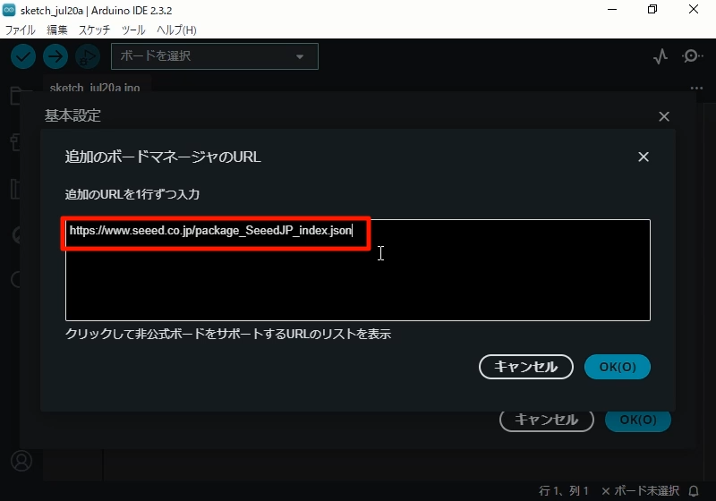
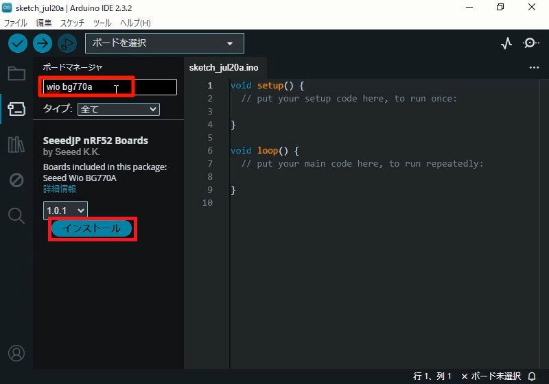
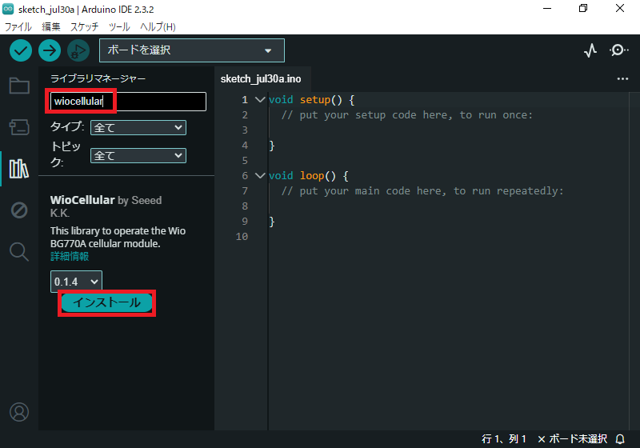
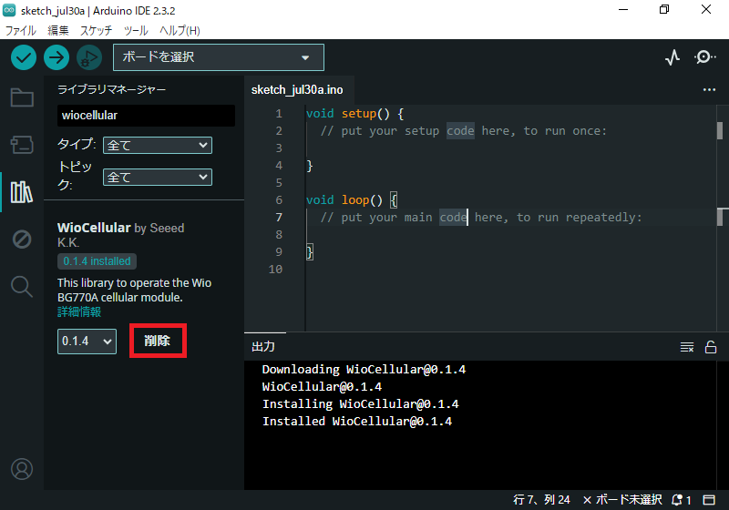
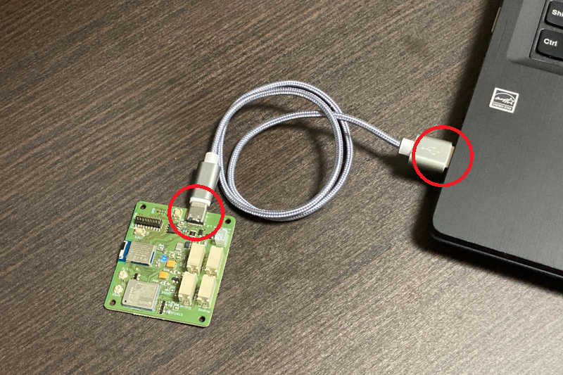
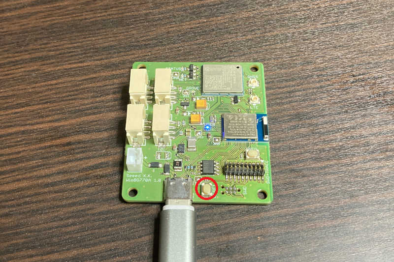
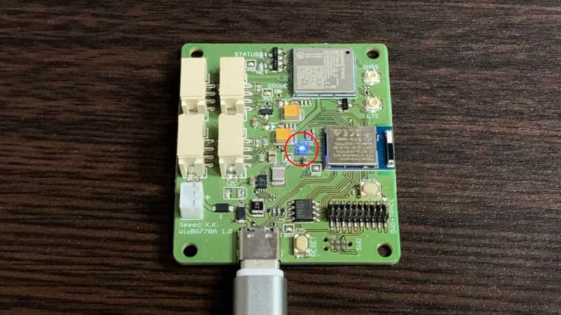
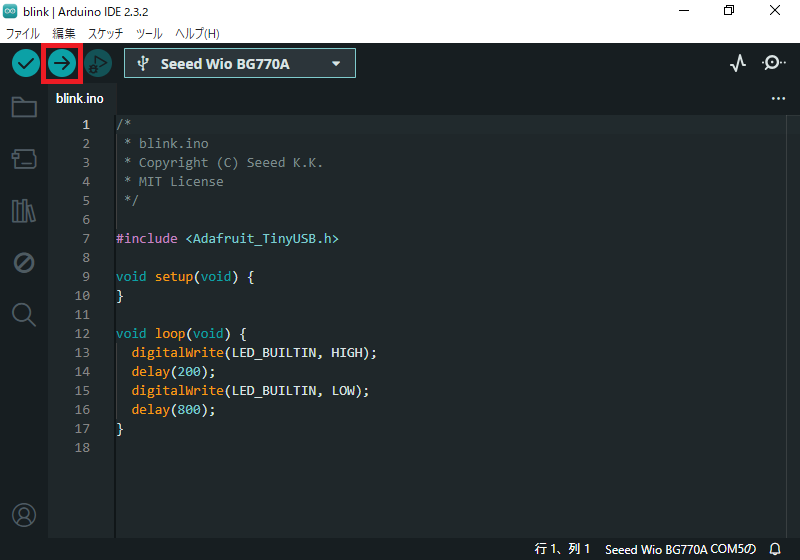
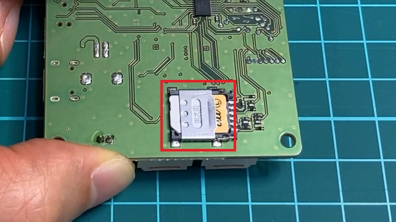

Wio BG770A ユーザーマニュアル

# 1. はじめに

# 2. LEDを点滅する

## 2-1. 開発環境を準備する

Wio BG770Aの開発はArduino IDEで行います。
Seeed JP nRF52 Boardsを加えるとコンパイルと書き込みができるようになり、WioCellularを加えるとセルラーモジュールを操作するライブラリを利用することができるようになります。

* Arduino IDE

    統合開発環境です。
    コードの編集、コンパイル、Wio BG770Aへアップロード、Wio BG770Aのモニタリングが1つのソフトウェアで出来ます。

* SeeedJP nRF52 Boards

    Wio BG770A用のコンパイラや基本ライブラリが含まれているボードサポートパッケージです。
    Arduino IDEは標準ではArduino公式ボードしか対応していませんが、このボードサポートパッケージをインストールすると、Wio BG770Aの開発ができるようになります。

* WioCellular

    セルラーモジュールを操作するライブラリです。
    このライブラリを利用すると自らコーディングするよりも短期間でセルラー通信を実現できます。

### Arduino IDEをインストール

ArduinoのWebサイト(https://www.arduino.cc/en/software)からArduino IDEをダウンロードしてPCにインストールしてください。
インストールの手順はArduinoの「Downloading and installing the Arduino IDE 2」(https://docs.arduino.cc/software/ide-v2/tutorials/getting-started/ide-v2-downloading-and-installing/)にあります。

### SeeedJP nRF52 Boardsをインストール

-> 動画([Install SeeedJP nRF52 Boards.mp4](media/Install%20SeeedJP%20nRF52%20Boards.mp4))

Arduino IDEからSeeedJP nRF52 Boardsを探し出せるよう、ボードサポートパッケージインデックスのURLをArduino IDEに登録します。
Arduino IDEの基本設定画面(メニューの「ファイル」>「基本設定」)を開いて、「追加のボードマネージャのURL」に`https://www.seeed.co.jp/package_SeeedJP_index.json`を追加してください。

次に、Arduino IDEにSeeedJP nRF52 Boardsをインストールします。ボードマネージャ画面で`wio bg770a`を検索して、一覧に表示された「SeeedJP nRF52 Boards by Seeed K.K.」のところにある「インストール」をクリックしてください。

正常にインストールされると「インストール」の表示が「削除」に変わります。

### WioCellularをインストール

ライブラリマネージャー画面で`wiocellular`を検索して、一覧に表示された「WioCellular by Seeed K.K.」のところにある「インストール」をクリックしてください。

正常にインストールされると「インストール」の表示が「削除」に変わります。

## 2-2. スケッチを書き込む

### PCとWio BG770Aを接続

PCとWio BG770AをUSBケーブルで接続してください。

### DFUモードに切替

-> 動画([Switch to DFU mode.mp4](media/Switch%20to%20DFU%20mode.mp4))

RESETボタンをダブルクリックしてください。
DFUモードに切り替わると、USER LEDがフワフワと点滅してPCに`BOOT`というボリューム名のドライブが表示されます。

### blinkスケッチをアップロード

-> 動画([Write sketch.mp4](media/Write%20sketch.mp4))

blinkスケッチを開きます。
Arduino IDEのメニュー「ファイル」>「スケッチ例」>「Wio Cellular」>「basic」>「blink」を選んでください。
すると、blinkスケッチのArduino IDEウィンドウが起動します。
元のArduino IDEウィンドウは閉じてください。

ボードをWio BG770Aに切り替えます。
画面上部のボード選択欄で「Seeed Wio BG770A COMx」を選んでください。

ボードのオプションを設定します。
Arduino IDEのメニュー「ツール」配下に表示されている下記項目を設定してください。

* Board Version = "1.0"
* Print Port = "None"
* SoftDevice = "S140 7.3.0"

blinkスケッチをコンパイルして、Wio BG770Aへ書き込みます。
書き込みボタンをクリックしてください。

正しく書き込みできると、USER LEDが点滅します。(0.2秒点灯/0.8秒消灯)

# 3. セルラーネットワークに接続する

## 3-1. LTEアンテナとSIMを取り付ける

### LTEアンテナを接続

-> 動画([Connect LTE antenna.mp4](media/Connect%20LTE%20antenna.mp4))

Wio BG770Aに同封のPCBアンテナを、Wio BG770Aの「LTE」アンテナコネクタに接続してください。
LTEアンテナコネクタの挿抜回数上限は30回と少ないので、できる限りLTEアンテナを取り付けたままにしておきましょう。

### SIMを取り付け

-> 動画([Install SIM.mp4](media/Install%20SIM.mp4))

SIMスロットの金属カバーをOPEN方向にスライドした後、上方向に開いてnanoSIMを置いてください。
その際、nanoSIMの向きに注意してください。（角が欠けている箇所を合わせてください。）

そして、金属カバーを閉じてLOCK方向にスライドしてロックしてください。

# 付録

## A. ソフトウェアの起動シーケンス

Wio BG770Aのソフトウェアは、フラッシュメモリに書き込まれたMBR、ブートローダー、アプリケーションの順に実行します。

* MBR

    MBRはアプリケーション、SoftDevice、ブートローダーを更新するインターフェースを提供します。> [Master boot record@Nordic](https://docs.nordicsemi.com/bundle/sds_s140/page/SDS/s1xx/mbr_bootloader/mbr.html)

    工場出荷時にフラッシュメモリへ書き込んであります。

* ブートローダー

    ブートローダーはUSBインターフェースからアプリケーションの書き換えを可能にします。APPモードとDFUモードがあります。

    * **APPモード** (APPlication mode)

        通常、ブートローダーはAPPモードで起動します。
        APPモードは既に書き込まれているあなたのアプリケーションを実行します。

    * **DFUモード** (Device Firmware Update mode)

        RESETボタンをダブルクリック、もしくは特殊なUSB CDCシーケンスで接続されると、ブートローダーはDFUモードで起動します。
        DFUモードではアプリケーションをUSB CDCやUSB MSDで書き込むことができます。

    ブートローダーは工場出荷時にフラッシュメモリへ書き込んであります。

    * [Adafruit nRF52 Bootloader@GitHub](https://github.com/SeeedJP/Adafruit_nRF52_Bootloader)

* アプリケーション

    Arduino IDEなどを使って作成したアプリケーションです。

> **NOTE:** Arduino IDEからスケッチのアップロードができないときは、Wio BG770AをDFUモードに変更してからアップロードすると解決することがあります。

## B. スケッチのアップロード

「2-2. スケッチを書き込む」では、RESETボタンをダブルクリックしてDFUモードにしてからアップロードしていましたが、APPモードでもArduino IDEでCOM番号を選択してスケッチをアップロードできます。

* DFUモードでCOM認識（ブートローダーが動いている）

  COM番号を選択してスケッチをアップロードする。

* APPモードでCOM認識（COM有効なアプリケーションが動いている）

  COM番号を選択してスケッチをアップロードする。

* APPモードでCOM認識できない（COM無効なアプリケーションが動いている）

  RESETボタンをダブルクリックしてDFUモードに切り替えた後、COM番号を選択してスケッチをアップロードする。
