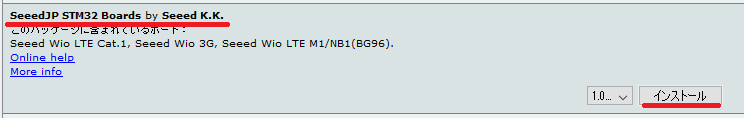

# Seeed Wio LTE Cat.1ボードの追加

1. Arduino IDEを起動します。
1. ファイル > 環境設定 （Macでは、Arduino > Preferences...）の 設定タブ にある"追加のボードマネージャのURL:"に、`http://www.seeed.co.jp/package_SeeedJP_index.json`を入力します。  

1. ツール > ボード > ボードマネージャ で、`SeeedJP STM32 Boards by Seeed K.K.`を選択し、インストールをクリックします。  

### 上記手順の動画 (クリックでYouTubeへ移動します)

