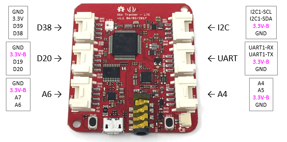
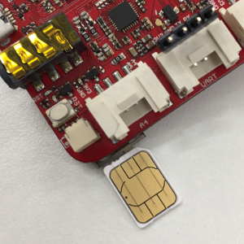

# ハードウェア

## 外観

* 3.3V-Bは、[ソフトウェア](Reference-ja.md#powersupplygrove)で電源ON/OFF。
* I/O電圧は、3.3V。

## Groveコネクターのピン割当

|Groveコネクターピン|STM32F4ピン|
|:--|:--|
|D38|PC6|
|D39|PC7|
|D20|PB4|
|D19|PB3|
|A6|PA6|
|A7|PA7|
|A4|PA4|
|A5|PA5|
|UART1-RX|PB7|
|UART1-TX|PB6|
|I2C1-SCL|PB8|
|I2C1-SDA|PB9|

## SIM

nano SIMとTFカードの2in1ソケットを実装しています。

nano SIMを差すときは、下図のように端子面を基板側にして挿入してください。

### 動作確認済みSIM

|メーカー|製品名|動作確認結果|
|:--|:--|:--|
|SORACOM|SORACOM Air SIMカード サイズ:ナノ（データ通信のみ）|〇|
|SORACOM|SORACOM Air SIMカード サイズ:ナノ（SMS/データ通信）|〇|
|IIJmio|音声機能付きSIM みおふぉん|〇|
|nuroモバイル|0 SIM データ専用プラン|〇|

## USB電源供給

電流が2A以上供給できるUSB電源と、高品質なUSBケーブルを使用してください。

> USBケーブルの抵抗が大きい場合、LTEモジュール電源をONしたときに再起動してしまう事象が発生しています。

## Wio LTE v1.3での変更点

Wio LTE発売後のお客様からのフィードバックを受け、製品を改良しました。電源回路に以下の変更が行われています。

* PMICを、より安定したMP2617に変更。
* LTEモジュールに電源を供給していたDC-DCモジュールを無くしました。
* 100uFのコンデンサを、電源の安定化のために追加。

PMICの変更に伴い、バッテリのインジケーターが追加されています。

|充電状態|LED表示|
|:--|:--|
|充電中|点灯|
|満充電|消灯|
|未接続|点滅|

**リチウムイオン電池の取り扱いには、十分な注意を要します。ご使用による機器の破壊や事故、これらに伴う被害・損害については当社では一切の責任を負いかねます。**

## 仕様

|部品|機能|値|
|:--|:--|:--|
|STM32F4マイコン|プロセッサー|STM32F405RG, ARM Cortex-M4, 168MHz|
||フラッシュメモリ|1Mバイト|
||内蔵SRAM|192Kバイト|
|LTE|LTE Cat.1|FDD-LTE B1/B3/B8/B18/B19/B26|
|インターフェイス|SIM|nano SIM (2 in 1 socket)|
||SD|TFカード (2 in 1 socket)|
