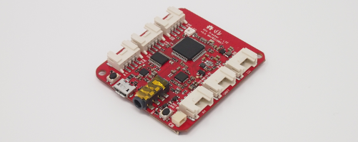

# Wio LTE for Arduino

Wio LTEのArduino IDE用ライブラリです。

## Wio LTE

Wio LTEは、Seeedが開発しているマイコンモジュールです。

GroveコネクターとSTM32F4マイコン、LTEモジュールが載っており、Arduino IDEで素早くプロトタイピングすることができます。

## 機能

|カテゴリー|機能|スケッチ例|注記|
|:--|:--|:--|:--|
|電源制御|LTEモジュール電源|||
||Groveコネクター電源|||
|表示|フルカラーLED表示|basic/LedSetRGB||
|LTE|受信強度|basic/GetRSSI||
||NTP時刻同期|basic/GetTime||
||SMS送信|sms/SendSMS|日本語未対応|
||SMS受信|sms/ReceiveSMS|日本語未対応|
||UDP/TCPクライアント送信|||
||UDP/TCPクライアント受信|||
||HTTPクライアントGET||ContentType固定[^1]|
||HTTPクライアントPOST|http/ifttt-webhook|ContentType固定[^1]|

[^1]: application/x-www-form-urlencoded

## 開発環境のセットアップ

開発環境のセットアップは[こちら](Setup-ja)。

## ハードウェア

ハードウェアの情報は[こちら](Hardware-ja)。

## リファレンスマニュアル

リファレンスマニュアルは[こちら](Reference-ja)。

## サンプルプログラム

サンプルプログラムはWio LTEライブラリに同封しています。Ardino IDEの、ファイル > スケッチ例 > WioLTEforArduino 配下を選択して開きます。

|スケッチ例|内容|必要なもの|接続コネクター|
|:--|:--|:--|:--|
|basic/LedSetRGB|LEDをレインボー表示します。|||
|basic/GetRSSI|受信信号強度をシリアルモニタに表示します。|||
|basic/GetTime|NTPサーバーと日時同期して、日時をシリアルモニタに表示します。|SIM||
|basic/SDReadWrite|TFカードに書き込み/読み込みします。|TFカード||
|grove/grove-button|Grove - ボタンのON/OFFをシリアルモニタに表示します。|[Grove - ボタン](https://www.seeedstudio.com/Grove-Button-p-766.html)|D38|
|grove/grove-button-using-int|Grove - ボタンのON/OFFをシリアルモニタとLEDに表示します。|[Grove - ボタン](https://www.seeedstudio.com/Grove-Button-p-766.html)|D38|
|grove/grove-buzzer|Grove - ブザーを鳴らします。|[Grove - ブザー](https://www.seeedstudio.com/Grove-Buzzer-p-768.html)|D38|
|grove/grove-magnetic-switch|Grove - 磁石スイッチのON/OFFをシリアルモニタに表示します。|[Grove - 磁石スイッチ](https://www.seeedstudio.com/Grove-Magnetic-Switch-p-744.html)|D38|
|grove/grove-rotary-angle-sensor|Grove - 可変抵抗の回転量をシリアルモニタに表示します。|[Grove - 可変抵抗](https://www.seeedstudio.com/Grove-Rotary-Angle-Sensor-p-770.html)|A4|
|grove/grove-temperature-and-humidity-sensor|Grove - 温湿度センサーの温度、湿度をシリアルモニタに表示します。|[Grove - 温湿度センサー](https://www.seeedstudio.com/Grove-Temperature-%26-Humidity-Sensor-p-745.html)|D38|
|grove/grove-ultrasonic-ranger|Grove - 超音波距離センサーの距離をシリアルモニタに表示します。|[Grove - 超音波距離センサー](https://www.seeedstudio.com/Grove-Ultrasonic-Ranger-p-960.html)|D38|
|grove/grove-gps|Grove - GPSの位置情報をシリアルモニタに表示します。|[Grove - GPS](https://www.seeedstudio.com/Grove-GPS-p-959.html)|UART|
|grove/grove-accelerometer|Grove - 加速度センサーの値をシリアルモニタに表示します。|[Grove - 3軸デジタル加速度センサー(±16g)](https://www.seeedstudio.com/Grove-3-Axis-Digital-Accelerometer%28%C2%B116g%29-p-1156.html)|I2C|
|sms/SendSMS|指定の電話番号へSMSを送信します。|SIM||
|sms/ReceiveSMS|受信したSMSをシリアルモニタに表示します。|SIM||
|soracom/soracom-funnel|Wio LTEの稼働時間をSORACOM Funnelへ送信します。|[SORACOM Air SIM](https://soracom.jp/services/air/cellular/), [SORACOM Funnel](https://soracom.jp/services/funnel/)||
|soracom/soracom-harvest|Wio LTEの稼働時間をSORACOM Harvestへ送信します。|[SORACOM Air SIM](https://soracom.jp/services/air/cellular/), [SORACOM Harvest](https://soracom.jp/services/harvest/)||
|http/ifttt-webhook|Wio LTEの稼働時間をIFTTTのWebhookへ送信します。|SIM, [IFTTT Webhook](https://ifttt.com/maker_webhooks)||
|mqtt/mqtt-client|Wio LTEの稼働時間をMQTTブローカーへ送信します。|SIM, MQTT Broker||
