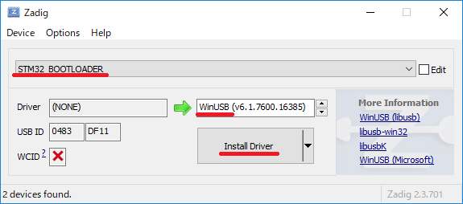

# WinUSBデバイスドライバーに切り替え

1. [Zadigサイト](http://zadig.akeo.ie/)のDownloadにあるZadig 2.3をクリックして、zadig-2.3.exeを入手します。
1. Wio LTEをDFUモードで接続します。
1. zadig-2.3.exeを起動します。
1. Options > List All Devices を選択します。
1. STM32 BOOTLOADER を選んで、右をWinUSBに変更してから、Install Driver(状況によってはReplace Driver)をクリックします。

### 上記手順の動画 (クリックでYouTubeへ移動します)

