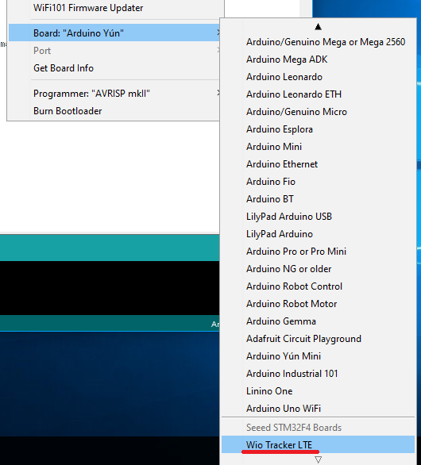

# Getting Started - Arduino IDE

First of all, you need to install the latest [Arduino IDE](https://www.arduino.cc/en/Main/Software), and add Seeed boards to your Arduino IDE.  
Note: Online IDE doesn't support Wio LTE.

## Getting Wio Tracker LTE support on Arduino IDE
Open your Arduino IDE, click on "Tool > Board". If you can find **Wio Tracker LTE**, you can skip this section.  

### Step.1 Setting your Arduino IDE
Open your Arudino IDE, click on File > Preferences, and copy below url to Additional Boards Manager URLs

	https://raw.githubusercontent.com/Seeed-Studio/Seeed_Platform/master/package_seeeduino_boards_index.json

### Step.2 Board Manager
Click on Toos > Board > Board Manager.

You will get many board that named with Seeed xxxx. Click "Seeed STM32F4 Boards by Seeed Studio" and then an Install button appear, click on it to finish the step, this process takes about 5 minutes to half an hour, which depend on the speed of your network.

## Adding Wio LTE library onto your IDE
Open your Arduino IDE, click on "Sketch > IncludeLibrary". If you can find **Wio LTE for Arduino**, you can skip this section.

1. Click on Sketch > Include Library > Manage Libararies... You will be prompted to select the library you would like to add.
1. Please enter "Wio LTE" on the "Filter your search..." box, then the "Wio LTE for Arduino" appeared. Click on the column, and then press "Install" button.
1. When the status comes "INSTALLED", pless "Close" button and close the dialog.

## How to choose the mode on Wio LTE, and check the device driver
The microcontrolled of Wio LTE have 2 modes, **DFU mode** and **Normal mode**.
**DFU mode** is the mode when we upload a Sketch which we developed with Arduino IDE. **Normal mode** is the mode to run a Sketch we uploaded.

Let's check each modes work properly.

### DFU mode

If you press the **BOOT button** when plugging in the USB cable, the microcontroller of Wio LTE will boot as DFU(Device Firmware Upgrade) mode.  
If the USB cable plugged in already, press and hold the **BOOT button** and click on **RST button**. So, the microcontrolled will also boot as DFU mode.

  

When the microcontrolled acting as DFU mode, you can find "STM32 BOOTLOADER" at "Universal Serial Device" part of Device Manager on your PC.

In case of you find "STM32 BOOTLOADER" on "Other Device" part, please proceed "Adding Wio LTE library onto your IDE" part on this page.Or in case of you find "STM Device in DFU Mode" at "Universal Serial Device" part of Device Manager on your PC, please proceed [WinUSBデバイスドライバーに切り替え](ReplaceDriver-ja).

 

### 通常モード

ボタンを押さずにUSBコネクターにUSBケーブルを接続すると、マイコンが通常モードで起動します。
すでにUSBケーブルが接続されている場合は、**RSTボタン**をクリックすると、DFUモードで再起動します。
デバイスマネージャーの"ポート"配下に"STMicroelectronics Virtual COM Port"が表示されていれば正常です。

"ほかのデバイス"配下に"STM32 Virtual ComPort in FS Mode"と表示されている場合は、[Virtual COM Portデバイスドライバーのインストール](InstallVCOMDriver-ja)を実施してください。

## プログラムの書き込み

マイコンをDFUモードにしておき、スケッチ例にあるbasic/LedSetRGBを開いて書き込みます。Wio LTE上のLEDがカラフルに点灯すれば正常です。

"dyld: Library now loaded: /opt/local/lib/libusb-1.0.0.dylib"と表示されて書き込みできない場合は、[libusb](Installlibusb-ja)をインストールしてください。