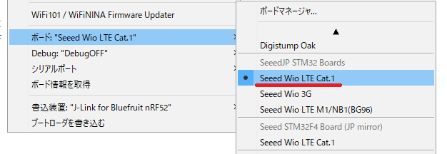

# 開発環境のセットアップ

## Arduino IDEのインストールとセットアップ

### Arduino IDEのインストール

パソコンにArduino IDEがインストールされていない場合は、[ArduinoのSoftwareサイト](https://www.arduino.cc/en/Main/Software)のDownload the Arduino IDEにあるARDUINO x.x.xをダウンロード、インストールしてください。
Wio LTEはOnline IDEに対応していませんのでご注意ください。

### Seeed Wio LTE Cat.1ボードの追加

Arduino IDEを起動して、"ツール > ボード"に**Seeed Wio LTE Cat.1**が表示されているか確認してください。
Seeed Wio LTE Cat.1が見つからない場合は、[Seeed Wio LTE Cat.1ボードの追加](AddWioLTEBoard-ja.md)を実施してください。

> 以前はボード名が`Wio Tracker LTE`でしたが`Seeed Wio LTE Cat.1`に変更になりました。

### Wio LTEライブラリの追加

Arduino IDEの、"スケッチ > ライブラリをインクルード"に**Wio LTE for Arduino**が表示されているか確認してください。
Wio LTE for Arduinoが見つからない場合は、[Wio LTEライブラリの追加](AddWioLTELibrary-ja.md)を実施してください。

## Wio LTEのモード切替とデバイスドライバーの動作確認

Wio LTEのマイコンは、**DFUモード**と**通常モード**の2つのモードがあります。
**DFUモード**はArduino IDEで作成したプログラムをマイコンへ書き込むときに使用するモードで、**通常モード**はマイコンへ書き込んだプログラムを実行するモードです。

それぞれのモードが正しく動作することを確認します。

### DFUモード

**BOOTボタン**を押しながらUSBコネクターにUSBケーブルを接続すると、マイコンがDFU(Device Firmware Upgrade)モードで起動します。
すでにUSBケーブルが接続されている場合は、**BOOTボタン**を押しながら**RSTボタン**をクリックすると、DFUモードで再起動します。

 

マイコンをDFUモードで起動して、デバイスマネージャーに**ユニバーサルシリアルバスデバイス > STM32 BOOTLOADER**が表示されていれば正常です。

下図のように、**ほかのデバイス > STM32 BOOTLOADER**と表示されていたり、**ユニバーサルシリアルバスコントローラー > STM Device in DFU Mode**と表示されている場合は[WinUSBデバイスドライバーに切り替え](ReplaceDriver-ja.md)を実施してください。

 

### 通常モード

ボタンを押さずにUSBコネクターにUSBケーブルを接続すると、マイコンが通常モードで起動します。
すでにUSBケーブルが接続されている場合は、**RSTボタン**をクリックすると、通常モードで再起動します。
デバイスマネージャーに**ポート > STMicroelectronics Virtual COM Port**が表示されていれば正常です。

下図のように、**ほかのデバイス > STM32 Virtual ComPort in FS Mode**と表示されている場合は、[Virtual COM Portデバイスドライバーのインストール](InstallVCOMDriver-ja.md)を実施してください。

## プログラムの書き込み

マイコンをDFUモードにしておき、"ファイル > スケッチ例 > Wio LTE for Arduino"にあるbasic/LedSetRGBを選択して、開いたスケッチを書き込みます。書き込んだ後にRSTボタンをクリック（通常モードで動作）して、Wio LTE上のLEDがカラフルに点灯すれば正常です。

"dyld: Library now loaded: /opt/local/lib/libusb-1.0.0.dylib"と表示されて書き込みできない場合は、[libusb](Installlibusb-ja.md)をインストールしてください。

