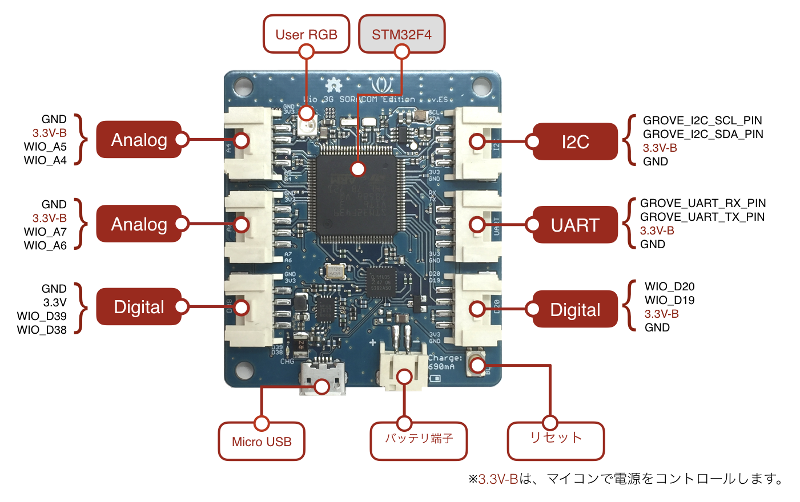
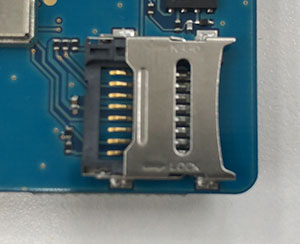
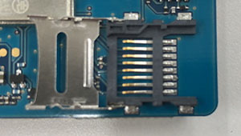
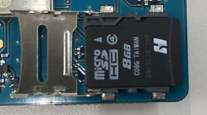
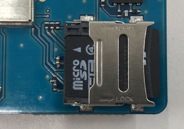

# ハードウェア（Wio 3G）

## バージョン

|Version|日付|
|:--|:--|
|ES|2018/04/26|

## 外観

## 仕様

|部品|機能|値|
|:--|:--|:--|
|STM32F4マイコン|プロセッサー|STM32F439VI, ARM Cortex-M4 with FPU, 180MHz|
||フラッシュメモリ|2Mバイト|
||内蔵SRAM|256Kバイト|
|3G|UMTS|800/850/900/1900/2100MHz|
||GSM/EDGE|850/900/1800/1900MHz|

## バッテリについて
Wio 3Gのバッテリ端子にリチウムイオン電池を接続することで、Micro USBからの電源供給が途絶えたときにバッテリで継続動作させることが出来ます。  

Wio 3Gには充電回路が載っているため、Micro USBに電源供給すると自動的にリチウムイオン電池に充電します。

|充電状態|充電LED表示|
|:--|:--|
|充電中|点灯|
|満充電|消灯|
|未接続|点滅|

Wio 3Gのバッテリ端子は、JST PH型コネクタです。次の点に注意してください。

* 極性が正しいこと。（電池の＋側の線が、コネクタ横に＋と書かれているほうに繋がること。）
* 690mAh以上の容量のリチウムイオン電池であること。（690mAで充電するため、これ以下の容量の電池を繋いで充電すると、大変危険な場合があります。）
* 充電中は決して放置せず、絶えず目を離さないようにしてください。

**リチウムイオン電池の取り扱いには、十分な注意を要します。ご使用による機器の破壊や事故、これらに伴う被害・損害については当社では一切の責任を負いかねます。**

## TFカードの取り付け方

1. OPENと矢印が書いてある、写真左方向に金属のフタをスライドさせます。  

1. ロックが解除されるので、フタを開けます。  

1. TFカードをトレイに載せます。  

1. フタを閉じ、軽く押しながら、LOCKと書いてある写真右方向にフタをスライドさせ、ロックします。  

取り外すときは、逆の手順です。

## 回路図

* [Wio 3G SORACOM Edition v.ES(PDF)](https://github.com/SeeedJP/Wiki/raw/master/Wio_3G_for_Arduino/files/Wio_3G_vES.pdf)
