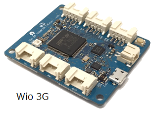
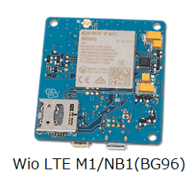

# Wio cell lib for Arduino

A library to support Wio 3G and Wio LTE M1/NB1(BG96) for Arduino IDE.

## Wio 3G / Wio LTE M1/NB1(BG96)

Wio 3G and Wio LTE M1/NB1(BG96) is the MCU boards developed by Seeed. There are STM32F4 microcontroller, Grove connector and cellular module, and it can be develop with Arduino IDE or Mbed OS. Wio 3G have 3G (UMTS) module, Wio LTE M1/NB1(BG96) have LTE Cat.M1/NB1 module.

## To setup Arduino dev env

To setup Arduino IDE, [here](setup-en.md) is the instruction.

## Hardware

Wio 3G hardware information is [here](hardware-en.md).  
Wio LTE M1/NB1(BG96) hardware information is [here](hardware-bg96-en.md).

## Reference manual

Reference manual is [here](reference-en.md)。

## Sample sketch

|Name of the sketch|Description|Requirement|Grove Connector|
|:--|:--|:--|:--|
|basic/LedSetRGB|RGB blinky|||
|basic/GetRSSI|Printing RSSI on serial monitor|||
|basic/GetTime|Get a real time through network, and printing datetime on serial monitor.|||
|basic/SDReadWrite|Reading/writing TF card|TF card||
|grove/grove-button|Printing ON/OFF status of Grove - Button on serial monitor.|[Grove - Button](https://www.seeedstudio.com/Grove-Button-p-766.html)|D38|
|grove/grove-buzzer|Buzzing Grove - Buzzer.|[Grove - Buzzer](https://www.seeedstudio.com/Grove-Buzzer-p-768.html)|D38|
|grove/grove-magnetic-switch|Printing ON/OFF status of Grove - Magnetic Switch on serial monitor.|[Grove - Magnetic Switch](https://www.seeedstudio.com/Grove-Magnetic-Switch-p-744.html)|D38|
|grove/grove-rotary-angle-sensor|Printing angle of Grove - Rotary Angle Sensor on serial monitor.|[Grove - Rotary Angle Sensor](https://www.seeedstudio.com/Grove-Rotary-Angle-Sensor-p-770.html)|A4|
|grove/grove-temperature-and-humidity-sensor|Printing temp/hum sensed with Grove - Temperature & Humidity Sensor on serial monitor|[Grove - Temperature & Humidity Sensor](https://www.seeedstudio.com/Grove-Temperature-%26-Humidity-Sensor-p-745.html)|D38|
|grove/grove-ultrasonic-ranger|Printing range sensed with Grove - Ultrasonic Ranger on serial monitor.|[Grove - Ultrasonic Ranger](https://www.seeedstudio.com/Grove-Ultrasonic-Ranger-p-960.html)|D38|
|grove/grove-gps|Printing position captured with Grove - GPS on serial monitor.|[Grove - GPS](https://www.seeedstudio.com/Grove-GPS-p-959.html)|UART|
|grove/grove-accelerometer|Printing sensed data by Grove - Accelerometer on serial monitor.|[Grove - 3-Axis Digital Accelerometer (±16g)](https://www.seeedstudio.com/Grove-3-Axis-Digital-Accelerometer%28%C2%B116g%29-p-1156.html)|I2C|
|soracom/soracom-funnel|Send uptime of Wio to SORACOM Funnel.|[SORACOM Funnel](https://soracom.jp/services/funnel/)||
|soracom/soracom-harvest|Send uptime of Wio to SORACOM Harvest.|[SORACOM Harvest](https://soracom.jp/services/harvest/)||
|soracom/soracom-unified|Send uptime of Wio to SORACOM Unified Endpoint.|[SORACOM Unified Endpoint](https://dev.soracom.io/jp/unified_endpoint/what-is-unified_endpoint/)||
|soracom/soracom-ussd-test|Send "123" to SORACOM beam by USSD.|[SORACOM Beam](https://soracom.jp/services/beam/)||
|http/ifttt-webhook|Send uptime of Wio to IFTTT Webhook.|[IFTTT Webhook](https://ifttt.com/maker_webhooks)||
|mqtt/mqtt-client|Send uptime of Wio to MQTT Broaker.|MQTT Broker||
