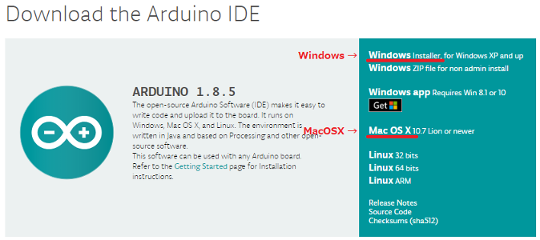
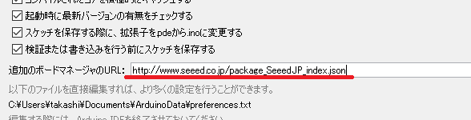
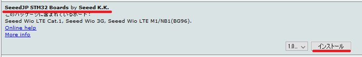
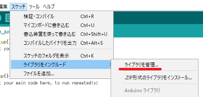
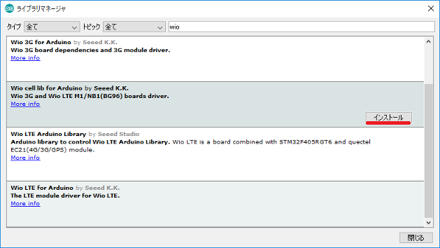
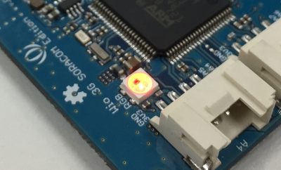

# How to setup Arduino IDE

## Installing Arduino IDE

If you don't get installed Arduino IDE on your PC, please navigate to [Arduino Software page](https://www.arduino.cc/en/Main/Software) and download ARDUINO x.x.x on "Download the Arduino IDE" section.  
**Wio 3G/Wio LTE M1/NB1(BG96) doesn't support Aruino IDE Linux version and Arduino Web Editor**.

**■ Donwloading Arduino IDE**  

## Adding board support

On the preference of Arduino IDE, enter `https://www.seeed.co.jp/package_SeeedJP_index.json` to "Additional Boards Manager URLs".

  

Then goes to the Boards Manager from Tools > Board. And search ReButton board package by entering "SeeedJP". Then choose `SeeedJP STM32 Boards by Seeed K.K.` and click the "install" button.

## Adding library

1. Navigate to Sketch > Include Library > Manage Library.

1. Choose `Wio cell lib for Arduino by Seeed K.K.` and install this. By typing `wio` to the search box, you can find it easily.  

## Installing serial port driver

If you are using Windows 10 or macOS, please skip this section.  
If you are using Windows 7 or Windows 8.1, please download "Arm Mbed Windows serial port driver" from [Windows serial driver](https://os.mbed.com/docs/latest/tutorials/windows-serial-driver.html) and install it.

# Checking your environment

1. Connect your Wio 3G/Wio LTE M1/NB1(BG96) to your PC via USB.（ A drive named DAPLINK will be shown.）
1. Launch Arduino IDE.
1. Choose your board at Tools > Boards on Arduino IDE.
1. Open LedSetRGB example from "File > Examples > Wio cell lib > basic > LedSetRGB".
1. Write LedSetRGB Sketch to Wio 3G/Wio LTE M1/NB1(BG96). ( Sketch > Upload )
1. Wait for finish writing.
1. Press the reset button on Wio 3G/Wio LTE M1/NB1(BG96). It could be marked as "BL".

